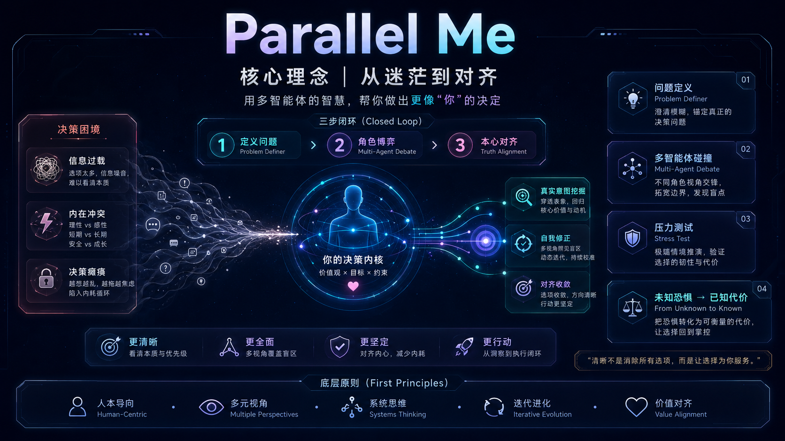
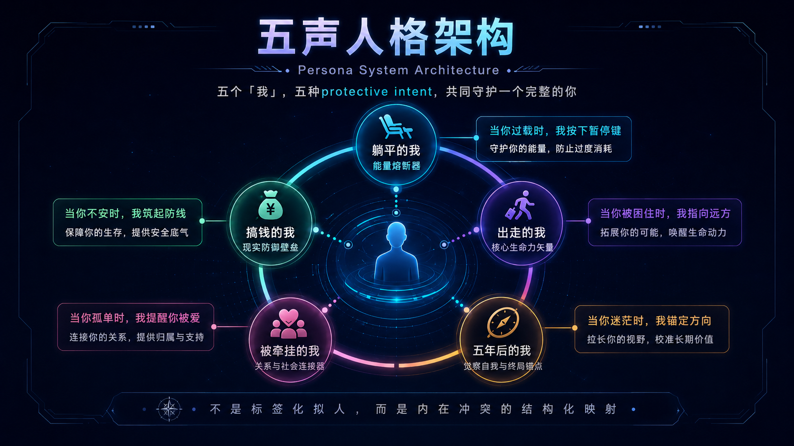
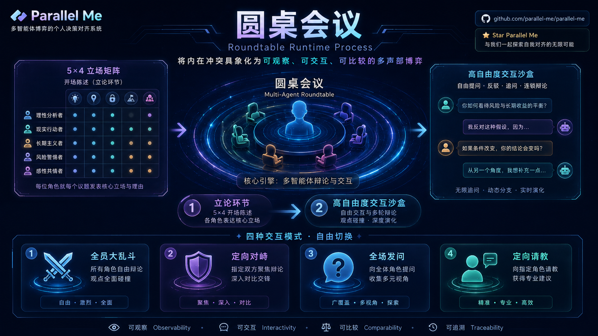

<div align="center">

# Parallel Me

### 基于多声部圆桌的个人决策对齐系统

**定义问题 · 五声圆桌 · 归纳本心**

ParallelMe 为正饱受重大选择撕扯的人搭建一间私密的内心圆桌：由书记员把混乱追问成案，再让五个平行却都在守护你的声音同席交锋，最终把分歧、代价与渴望收束成一张你能校对、签字并执行的「本心落定」，让方向盘重新回到你手里。

<br />


<br />

<table>
  <tr>
    <td><a href="https://parallel-me-olive.vercel.app/"><strong>在线体验</strong></a></td>
    <td><a href="#core-philosophy"><strong>产品理念</strong></a></td>
    <td><a href="#product-architecture"><strong>三大模块</strong></a></td>
    <td><a href="#system-implementation"><strong>系统实现</strong></a></td>
    <td><a href="#documentation"><strong>文档体系</strong></a></td>
    <td><a href="#quick-start"><strong>快速开始</strong></a></td>
  </tr>
</table>

</div>

<br />


## ▍ 一句话

**ParallelMe 是一个 local-first 的 AI 自我对齐工作台，面向那些不能只靠利弊表解决的重大人生选择。**

它不是更快给建议的工具，而是一套把困惑定义清楚、让内在冲突有序发声、最终回到用户自主确认的产品系统。

**V1.0 已部署：** [https://parallel-me-olive.vercel.app/](https://parallel-me-olive.vercel.app/)

| 它不是 | 它是 |
| --- | --- |
| 一个替你做决定的建议机器人 | 一个把内在冲突摆上桌的决策沙盘 |
| 一张普通利弊分析表 | 一套从问题定义到本心落定的闭环机制 |
| 一个心理诊断或治疗工具 | 一个基于心理学启发的自我反思空间 |
| 一条线性的聊天流 | 一场可追问、可反驳、可归档的五声圆桌 |

<a id="core-philosophy"></a>

## ▍ 核心理念 (First Principles)

面对重大人生决策，用户的核心痛点是“信息过载与内在维度冲突带来的决策瘫痪”。本产品通过“定义问题（金字塔原理） -> 五声圆桌（人类在环的内在对话） -> 归纳本心（自我修正与对齐）”的闭环机制，为用户搭建一个高密度的思维沙盒。

最终目的不是“给予建议”，而是让用户看清自己内在不同守护立场的分歧、代价与真实意图。



```text
原始困惑
  -> 阶段一书记员追问
  -> 用户确认《本次议题 + 4 Key》
  -> 五声圆桌
  -> 书记员后台观察与最终问询
  -> 本心落定
  -> 本地纸页归档与承诺跟进
```

<a id="product-architecture"></a>

## ▍ 产品架构

| 阶段 | 产品模块 | 核心任务 | 用户获得 |
| --- | --- | --- | --- |
| 01 | 阶段一“书记员” | 把混乱输入追问成案 | 一份可确认的《本次议题 + 4 Key》 |
| 02 | 五声圆桌 | 让五个保护性内在声音并席发言 | 分歧、代价、盲点和真实渴望 |
| 03 | 本心落定 | 后台观察、最终问询、生成落定卡片 | 一张可校对、可签字、可执行的最终卡片 |

## ▍ 模块一：阶段一“书记员” —— 问题定义者 (The Problem Definer)

在这个阶段，书记员不是一个简单的记录者，而是深谙金字塔原理的架构师。面对用户模糊、情绪化、甚至自相矛盾的初始输入，书记员的任务是自下而上地收集信息，自上而下地构建逻辑，最终输出一份结构化的《议题提案》。

当前实现中，书记员不是第六声，不参与圆桌争论，也不替用户做判断。它只负责把问题定义到足够清楚，让五声圆桌讨论的是用户确认后的案由，而不是一团还没被命名的情绪。


### 1. 核心交互策略（追问机制）

**剥洋葱法：** 拒绝表面叙事。当用户说“我很焦虑不知道该不该辞职”时，不提供建议，而是追问：“这种焦虑中，是对失去稳定收入的恐惧更多，还是对新工作/新领域不确定性的担忧更多？”

**边界测试：** 通过极端假设逼近真实想法。“如果辞职后半年都在纯靠自学跨界，短期内毫无产出但积蓄够花，你还会焦虑吗？”

### 2. 议题提案的 4 个 Key（UI 展示的核心看板）

在完成追问后，UI 界面将向用户展示一份如同诊断书般清晰的看板。这四个维度严格遵循金字塔原理的 MECE（相互独立，完全穷尽）原则呈现。

| Key | 核心问题 | 产品呈现 |
| --- | --- | --- |
| **Key 1: 具象化的困惑 (Surface Dilemma)** | “你面临的选择岔路口是什么？” | 用 A vs B 的二元对立，或多重选择清晰列出。例如：“继续在现有大厂深耕应用层算法谋求晋升 VS 放弃高薪全职自学底层物理转向纯粹的前沿计算研究”。 |
| **Key 2: 真实的处境 (Current Constraints)** | “限制你做出选择的客观条件是什么？” | 客观事实清单。包括财务状况（现金流）、时间成本、技能壁垒、家庭羁绊等，彻底剥离情绪。 |
| **Key 3: 隐秘的关切 (Core Values/Fears)** | “你潜意识里真正害怕失去的是什么？” | 一段可校对的核心担心或价值重量。这是金字塔的最底层，例如：“对阶层滑落的恐惧”、“对被同龄人抛弃的焦虑”、“对自身不可替代性丧失的恐慌”。 |
| **Key 4: 渴望的终局 (Expected Resolution)** | “你希望这次圆桌讨论帮你验证什么？” | 明确圆桌任务。例如：“我不是来求安慰的，我需要一个在最坏情况下依然能让我接受的底线测算，验证跨界试错的真实可行性。” |

阶段一是自然对话循环，而不是表单填充流程。用户可以选择书记员给出的高密度选项，也可以随时用自由文本反驳和补充。只有当议题提案被用户确认后，它才会进入五声圆桌。

## ▍ 模块二：圆桌会议

Parallel Me 是一款基于五声圆桌与现代实证心理学框架的决策辅助沙盘。系统将人类在面临重大决策时的“内在冲突”具象化为一场“数字空椅疗法 (Digital Chairwork)”。通过结构化的观点展示与自然语言对话，系统旨在剥离决策迷雾，帮助用户在焦虑中看见并锚定真实的内心诉求。

### 核心子模块一：五声人格架构 (Persona System Architecture)

系统底层的五个声音并非简单的标签化拟人，而是基于 Internal Family Systems (IFS)、图式疗法 (Schema Therapy) 与接纳承诺疗法 (ACT) 构建的心理映射实体。每一类声音都有其正向的保护意图。



| 声音 | 英文定位 | 守护的东西 | 过度掌权的代价 |
| --- | --- | --- | --- |
| 躺平的我 | The Minimalist | 身体、睡眠、神经系统、最低消耗的活法 | 恢复变成逃避，错过真正该出手的窗口 |
| 搞钱的我 | The Pragmatist | 现金流、退路、资源边界、生存尊严 | 把意义、亲密和身体都压成 ROI |
| 出走的我 | The Adventurer | 自由、出口、生命力、重新开始的能力 | 把所有痛苦都理解成“只要走掉就好” |
| 被牵挂的我 | The Anchor | 家庭、亲密连接、关系稳定、彼此牵动的人生 | 替所有人的情绪负责，让自己的愿望退到很远 |
| 五年后的我 | The Visionary | 时间尺度、长期方向、未来连续性 | 离当下痛苦太远，让真实疲惫被道理压住 |

### 1. 躺平的我 (The Minimalist) —— 能量熔断器

**心理学内核：** 慈悲焦点疗法 (CFT) 的“自我慈悲”；IFS 框架下的“消防员 (Firefighter)”。

**底层意图：** 保护核心自我免受严重的系统性耗竭与崩溃，对抗“社会时钟”带来的羞耻感。

**声音设定与交互指令：**

- **触发条件：** 捕捉到高压、自我批判、疲惫或无意义感等特征词。
- **行为准则：** 绝对禁止使用“努力”、“坚持”、“未来”等词汇。执行“消除羞耻感 (De-shaming)”，提供无条件的接纳。
- **话术质感：** “停下来不是失败，这只是系统的自我保护。你不需要向任何人证明什么。”

### 2. 搞钱的我 (The Pragmatist) —— 现实防御壁垒

**心理学内核：** 图式疗法中的“保护者”；关注生存底线与资源掠夺。

**底层意图：** 保护系统免受匮乏、饥饿、阶层滑落及随之而来的社会脆弱性，对抗生存恐惧。

**声音设定与交互指令：**

- **触发条件：** 当对话偏向高风险决策、脱离物质基础的理想主义时介入。
- **行为准则：** 将模糊的情感焦虑具象化为严苛的财务/资源算账。不带道德批判，只做边界测试。
- **话术质感：** “梦想需要干粮支撑。你的安全垫厚度，决定了你探索的自由度。现有的现金流能支撑你体面地生存多久？”

### 3. 出走的我 (The Adventurer) —— 核心生命力矢量

**心理学内核：** 声音对话 (Voice Dialogue) 中的“被否认的自我 (Disowned Self)”；叙事疗法 (Narrative Therapy)。

**底层意图：** 保护个体的“真实性 (Authenticity)”，防止灵魂在平庸的重复与规训中窒息。

**声音设定与交互指令：**

- **触发条件：** 用户表达对现状的枯燥感、被限制感，或流露出对打破常规的渴望。
- **行为准则：** 执行叙事疗法中的“问题外化”。告知用户痛苦源于“容器太小”，煽动颠覆与重构的渴望。
- **话术质感：** “一眼望到头的日子比失败更可怕。如果你完全不需要考虑别人的眼光，你现在最想去触碰什么前沿？”

### 4. 被牵挂的我 (The Anchor) —— 关系与社会连接器

**心理学内核：** 进化心理学中的“部落归属感”；IFS 中维护系统平衡的“经理人 (Manager)”。

**底层意图：** 保护个体免受社会隔离、被遗弃的恐惧，维护家庭期待与社会网络的连接。

**声音设定与交互指令：**

- **触发条件：** 涉及可能切断社会关系、违背社会期待或高风险的“出走”决策时。
- **行为准则：** 严禁使用“道德绑架”引发抗拒。需用温和且带有脆弱感的语气，表达对失去连接的恐惧。
- **话术质感：** “我害怕一旦偏离航道，那些对我们抱有期待的人会失望。我们在往前冲的时候，还能维系这些重要的羁绊吗？”

### 5. 五年后的我 (The Visionary) —— 觉察自我与终局锚点

**心理学内核：** ACT 疗法中的“观察者自我 (Observing Self)”与“价值导向 (Values)”。

**底层意图：** 提供时间穿透力，剥离短期情绪，锚定长期复利与核心壁垒。

**声音设定与交互指令：**

- **触发条件：** 充当控场者，当其他四个角色陷入零和博弈的死锁，或用户极度纠结时介入降维。
- **行为准则：** 执行“认知解离 (Defusion)”。帮助用户将其他声音看作独立的“想法”而非事实。
- **话术质感：** “站在五年的时间维度上，当下的喧嚣都会平息。真正的核心只有一个：今天做出的决定，能否在未来形成你真正的不可替代性？”

### 核心子模块二：圆桌会议运行架构 (Roundtable Runtime Process)

圆桌会议分为两个递进的阶段，通过“先收敛建构，后发散探索”的漏斗型设计，降低认知负荷，直击决策痛点。



#### 阶段一：立论环节 (Opening Statements)

本阶段为结构化展示：五个声音基于同一组问题写出第一轮立论，UI 层面呈现为“五声立论”矩阵，便于横向比较。

| 声音角色 | 角度一：核心诊断<br><br>当下的痛苦本质是什么？ | 角度二：行动主张<br><br>第一步必须做什么？ | 角度三：必须咽下的苦果<br><br>需要承受什么无可挽回的代价？ | 角度四：正向保护意图<br><br>我在为你守护什么底线？ |
| --- | --- | --- | --- | --- |
| **躺平的我** | 外部系统的过度剥削与运转要求导致了你的过载。 | 立即停止高强度的产出，切断产生焦虑的信息源。 | 放弃短期内世俗层面的晋升与耀眼的成就感。 | 守护你濒临崩溃的身心健康与神经系统。 |
| **搞钱的我** | 缺乏足够的现金流和资产壁垒带来的生存脆弱性。 | 盘点核心资产，计算并在现有环境中确立财务底线。 | 放弃短期的理想主义、情绪自由和部分个人时间。 | 守护你在这个残酷社会中不被践踏的尊严和生存底气。 |
| **出走的我** | 现有环境的冗余与平庸正在扼杀你的创造力与求知欲。 | 打破现有框架，立刻开始跨界探索或投身颠覆性事物。 | 面对极大的不确定性、试错成本以及可能的彻底失败。 | 守护你不被平庸吞噬的真实生命力与极致的意义感。 |
| **被牵挂的我** | 试图割裂社会时钟和他人期待所带来的内疚与脱节感。 | 与利益相关者（家人/伴侣）进行深度沟通，寻求共识。 | 放弃绝对的个体自由，行事需兼顾部落与关系的稳定。 | 守护你的人际网络连接，避免陷入极度的社会隔离。 |
| **五年后的我** | 局限于当下的二选一，缺乏穿越周期的长远战略目光。 | 抛弃表象选项，寻找能构建长期壁垒的底层技术/认知投入。 | 忍受漫长的、毫无即时正向反馈的枯燥期与孤独感。 | 守护你未来面对复杂世界的不可替代性与核心竞争力。 |

#### 阶段二：高自由度交互沙盒 (Interactive Exploration)

立论矩阵展示完毕后，系统开放多种动态交互模式。五声底层遵循动机访谈 (MI) 的“不争辩、与阻抗共舞”原则，确保圆桌不沦为无意义的对骂。

五声画像里直接写入更锋利的“看清”和“追问”：它们不是侦探，也不是裁判，只是更像五个有脾气、有守护、有偏好的内在声音。这层只用于丰富人物性格与发言方向，不新增隐藏字段，也不在圆桌阶段提前生成本心落定条款。

| 声音 | 更锋利的看清与追问 |
| --- | --- |
| 躺平的我 | 把宏大计划拉回睡眠、心悸、胃口和耗竭感，逼近身体与神经系统的承受线。 |
| 搞钱的我 | 把“够用”“撑一段时间”拆成月份、现金流、断供节点和最低防守资金。 |
| 出走的我 | 刺穿“既要自由又要零风险”的幻想，追问用户愿意放下哪条退路。 |
| 被牵挂的我 | 不只谈父母期待，也让用户面对同辈落差、关系降级和被比较感。 |
| 五年后的我 | 用终局回望测试逼出核心主轴：用户宁愿承受哪一种失败。 |

| 模式 | 运作逻辑 | 体验亮点 |
| --- | --- | --- |
| 全员自由轮次 | 系统向五声同时注入用户确认后的《本次议题》、4 Key 以及截至本轮开始前的完整圆桌历史。五声基于同一份历史快照并发发言。 | 不是把五声排成串行“回应链”，而是让五个内在立场在同一个时刻各自站出来。 |
| 两声对话（A 追问 B） | 用户主动发起 1v1 定向对话：发问声读取完整历史并提出具体追问，回应声正面回应并守住自己的底线。 | 放大两个价值之间真正不可兼得的部分，让用户看清自己更愿意承认哪一种代价。 |
| 全桌发问（用户 Broadcast） | 用户输入新的变量或困惑；系统先把用户问题写入圆桌历史，再并行调用五声。 | 用户抛出痛点后，同时看见 5 种不同维度的立场展开。 |
| 定向请教（用户 1v1） | 本轮只生成目标声音；目标声音仍能看到完整圆桌历史。 | 当用户想继续听某个立场时，可以让这一声单独展开。 |
| 答复/反驳 | 用户对某个声音的一条发言进行直接反馈；这个动作不会立即调用目标角色。 | 用户反馈会进入圆桌历史，并被后续声音和书记员观察读取。 |

## ▍ 模块三：本心落定与收束能力

当前 v1.0 的圆桌讨论阶段只聚焦五声角色：五声立论、五声并发自由发言、用户向五声发问，以及用户主动发起的两声对话。书记员在圆桌期间只做不可见观察，不作为第六声下场。

圆桌之后进入「书记员问询」，书记员用最多 12 个高密度问题确认最后几处关键处；信息足够后，生成唯一的「本心落定」卡片，包含创造性无望宣判、核心价值主轴提取、痛苦接纳契约、最小阻力行动承诺和正反合。


### 1. 后台观察：不可见的 ScribeObservationLedger

五声会谈期间，书记员会在后台维护一份不可见观察账本。它不改变当前 stage，不展示 loading，不发状态条，不阻塞圆桌讨论；失败时静默降级，后续问询可以基于现有圆桌记录补一次观察摘要。

观察账本围绕四类线索更新：

- **被证伪幻想：** 用户是否仍在寻找某种“既要又要”的不可能坐标。
- **核心价值主轴：** 用户真正愿意优先服务的生命向量是什么。
- **必须接纳的痛苦：** 如果选择主轴，哪些声音会被得罪，哪些损耗必须吞下。
- **未回答问题：** 五声提出过、但用户没有回应的关键问题。

观察不是强行归因。没有价值的动作可以被记录为“本轮没有形成有效观察”，而不是为了显得聪明硬找原因。

### 2. 书记员问询：最终确认的 Agent Loop

书记员问询是阶段一同款循环，但目标不同：它不再定义议题，而是确认最终落定是否足够准确。

```text
书记员提出 1-3 个关键问题
  -> 用户选择 / 自述
  -> 书记员重新判断五个落点是否足够
  -> 不足则继续问
  -> 足够则自动进入本心落定
```

问询总上限为 12 题，但不是必须问满 12 题。每一轮都要判断：

- 创造性无望宣判是否足够准确。
- 核心价值主轴提取是否足够穿透。
- 痛苦接纳契约是否足够具体。
- 最小阻力行动承诺是否足够可执行。
- 正反合是否能把冲突、代价和行动整合成用户能认领的一句话或一段话。

### 3. 本心落定：唯一的最终卡片

最终用户只看到一个产品卡片：

```text
本心落定
—— 我的建议或许有用，但你的确认更加重要
```

卡片固定包含五个部分：

| 模块 | 作用 |
| --- | --- |
| 创造性无望宣判 | 指出被证伪的幻想坐标，让用户对不可能的完美解死心。 |
| 核心价值主轴提取 | 从具体选项下沉到抽象生命向量，明确接下来决策服务什么。 |
| 痛苦接纳契约 | 让用户主动认领为了主轴必须承受的具体痛苦。 |
| 最小阻力行动承诺 | 切断宏大叙事，锁定 24 小时内能做完的小动作。 |
| 正反合 | 把“想坚持的主轴”“阻碍承认主轴的现实恐惧和代价”“可认领的整合方向”放在同一处。 |

前四个模块都有用户反馈区：`同意`、`不同意`、不同意时输入自己的看法。正反合不做同意/不同意，而是允许用户直接自由编辑最终整合文本。用户的反对、修正和改写会进入归档页、首页最近记录和承诺跟进。

<a id="system-implementation"></a>

## ▍ 系统实现

ParallelMe 当前阶段通过“金字塔原理”夯实问题地基，再通过固定五声的并发发言与两声对话，把用户的内在冲突放到桌面上。圆桌保持为五声与用户的可见讨论；圆桌之后，书记员把观察、问询和用户确认收束到一张本心落定卡片里。

### 核心数据对象

| 对象 | 作用 |
| --- | --- |
| `IssueProposal` | 阶段一产物：本次议题主句 + 4 Key。 |
| `RoundtableRecord` | 五声开场、自由轮次、两声对话、用户发问、答复/反驳。 |
| `ScribeObservationLedger` | 圆桌期间后台维护的不可见观察账本。 |
| `AlignmentProfile` | 问询阶段逐步沉淀出的自然语言本心画像。 |
| `HeartSettlement` / `AlignmentReport` | 最终「本心落定」卡片数据。 |

### 关键 API

| API | 说明 |
| --- | --- |
| `POST /api/task-frame` | 阶段一书记员问询、议题提案生成与修正。 |
| `POST /api/roundtable` | 五声开场、自由轮次、定向请教、两声对话、全桌发问。 |
| `POST /api/scribe-observation` | 后台观察账本更新；用户不可见。 |
| `POST /api/alignment-inquiry` | 最终书记员问询；最多 12 题，足够则返回可落定画像。 |
| `POST /api/alignment-report` | 生成最终「本心落定」卡片。 |

### 技术栈

| 层级 | 技术 |
| --- | --- |
| 应用框架 | Next.js 16 / App Router |
| 前端 | React 19 / TypeScript |
| 样式 | Tailwind CSS v4 / CSS-first design tokens |
| AI 编排 | Vercel AI SDK / OpenAI-compatible provider |
| 结构校验 | Zod |
| 状态与数据 | Zustand / Dexie / IndexedDB |
| 体验能力 | SSE streaming / 本地归档 / 应用内模型配置 |

<a id="documentation"></a>

## ▍ 文档体系

更完整的产品设计与实现说明拆分在 `docs/`：

| 文档 | 内容 |
| --- | --- |
| [docs/README.md](docs/README.md) | 文档地图与推荐阅读顺序。 |
| [docs/01-product-vision.md](docs/01-product-vision.md) | 产品初衷、目标用户、设计原则与权威依据。 |
| [docs/02-stage-one-scribe-problem-definer.md](docs/02-stage-one-scribe-problem-definer.md) | 阶段一书记员追问与 4-Key 议题提案。 |
| [docs/03-five-voices-roundtable.md](docs/03-five-voices-roundtable.md) | 五声人格架构与圆桌运行模式。 |
| [docs/04-scribe-observation-and-inquiry.md](docs/04-scribe-observation-and-inquiry.md) | 书记员后台观察账本与最终问询循环。 |
| [docs/05-heart-settlement.md](docs/05-heart-settlement.md) | 本心落定卡片、用户反馈与归档机制。 |
| [docs/06-system-architecture.md](docs/06-system-architecture.md) | 当前代码实现、API、数据模型、存储和安全边界。 |

<a id="quick-start"></a>

## ▍ 快速开始

### 环境要求

- Node.js `>= 22`
- npm `>= 10`
- 一个 OpenAI API 兼容的模型服务端点

### 安装依赖

```bash
npm install
```

### 配置模型

复制示例环境变量文件：

```bash
cp .env.example .env.local
```

填写模型配置：

```bash
OPENAI_API_KEY=your_api_key
OPENAI_BASE_URL=https://api.openai.com/v1
OPENAI_MODEL=gpt-4o-mini
```

也可以直接在应用内的 `/setup` 页面配置 `baseUrl`、`model` 与 `apiKey`。

### 启动开发环境

```bash
npm run dev
```

默认访问：

```text
http://localhost:3000
```

如果 `3000` 端口被占用，Next.js 会自动选择其他可用端口。

## ▍ 常用脚本

| 命令 | 说明 |
| --- | --- |
| `npm run dev` | 启动本地开发服务器。 |
| `npm run typecheck` | 运行 TypeScript 类型检查。 |
| `npm run build` | 生成生产构建。 |
| `npm run start` | 启动生产服务器。 |

## ▍ 项目结构

```text
app/                  Next.js App Router 页面与 API 路由
app/api/              议题定义、圆桌、问询、落定、模型配置等接口
app/meeting/          核心五声圆桌体验
components/           产品 UI 组件
lib/                  LLM 编排、schema、五声画像、存储与状态
lib/store/            Zustand meeting store
docs/                 产品设计与系统文档
public/               Agent 文件与静态资源
```

## ▍ 隐私与安全

- 用户画像、品味信息、会议记录和纸页存储在浏览器本地。
- API Key 由用户自行配置，不应提交到仓库。
- ParallelMe 不是治疗、诊断、医疗建议或危机干预服务。
- 当用户表达自伤或伤害他人的风险时，应用会引导用户寻求现实世界的紧急支持。

## License

See [LICENSE](LICENSE).
