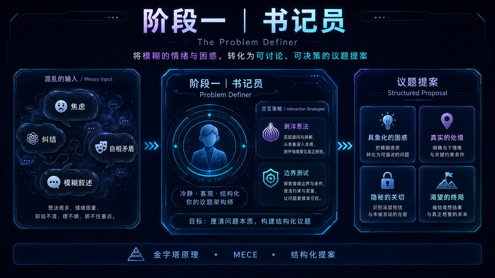

# 阶段一：书记员问题定义



阶段一的目标，是防止五声圆桌讨论一个还没有被说清楚的问题。

书记员不是第六声，也不是建议者。它是问题定义者：读取用户原始困惑，提出高密度追问，最终生成用户可校对的议题提案。

## 用户流程

```text
用户输入原始困惑
  -> 书记员判断是否足够成案
  -> 信息不足：提出 1-3 个高密度问题
  -> 用户选择选项或补充自由文本
  -> 书记员重新读取完整自然语言上下文
  -> 信息足够：生成 Issue Proposal + TaskFrame
  -> 用户确认、反对或要求修正
```

当前实现锚点：

- `app/api/task-frame/route.ts`
- `lib/llm.ts`
- `lib/v7.ts`
- `components/DefiningDialogueBoard.tsx`
- `components/IssueProposalBoard.tsx`

## 书记员职责

书记员有三条边界：

1. 只定义问题。
2. 不替用户选择。
3. 用自然语言表达，不把 schema、option id 或 confidence 暴露给用户。

它的语气由 `lib/scribe.ts` 中的 `scribePersonaBlock("brief")` 提供：像做了笔记的朋友，具体、克制、能说人话，但不下判断。

## 4 Key 议题提案

阶段一产物是 `IssueProposal`：

| Key | 回答的问题 | 产品含义 |
| --- | --- | --- |
| 具象化的困惑 | 用户面前的选择岔路口是什么？ | 表层 A/B 或多重选择。 |
| 真实的处境 | 限制用户做选择的客观条件是什么？ | 钱、时间、身体、家庭、工作制度、失败成本等。 |
| 隐秘的关切 | 用户真正害怕失去的是什么？ | 安全感、体面、自由、关系、身份、掌控感等。 |
| 渴望的终局 | 用户希望圆桌帮自己验证什么？ | 给五声圆桌的讨论任务。 |

四个 Key 必须彼此独立、共同穷尽。提示词中明确禁止写“待补充”“未知”“待明确”等占位符。

## 追问循环

`/api/task-frame` 当前支持三个主要 action：

| Action | 作用 |
| --- | --- |
| `probe` | 判断是否继续追问，或是否已经可以成案。 |
| `propose` | 直接生成议题提案。 |
| `refine` | 根据用户反馈修正提案，必要时继续追问。 |

追问循环不设置总轮次硬上限。系统每轮判断 4-Key 是否已经足够成案；信息足够时生成提案，信息仍缺时继续追问剩余缺口。

## 交互设计

每个书记员问题可以包含 2-4 个自然语言选项，并保留自由文本出口。系统会把最后一个自由出口规范到接近“都不准，我自己说”，让用户可以拒绝书记员的猜测。

阶段一追问现在有两层防重复保护：

- 每个问题必须标注它服务的 4-Key purpose，同一轮不会保留两个 purpose 相同的问题。
- 如果结构化生成失败，系统会根据已问过的问题、用户已回答内容、当前议题片段和书记员刚才的判断过程动态生成缺口感知 fallback，而不是退回固定题库。

特别地，`隐秘的关切` 和 `渴望的终局` 被强制拆开：前者只确认用户害怕失去什么，后者只确认圆桌最后要产出什么判断规则、代价排序、边界或观察期。

用户可以：

- 点选书记员给出的高密度选项
- 输入自己的补充
- 一次性回答多个问题
- 查看书记员的可见思考流
- 对最终议题提案进行确认或修正

体验目标是：系统承担结构化思考的负担，但用户保留最终校对权。

## 数据产物

阶段一会产生：

- `IssueProposal`：产品层可见的 4-Key 文档
- `TaskFrame`：供后续圆桌逻辑兼容使用的框架
- `DefiningDialogue`：书记员问题与用户回答的自然语言历史

只有用户确认后的议题提案进入五声圆桌。书记员成案前的追问过程不会直接成为五声讨论材料。

## 成功标准

阶段一成功时，用户应该能说：

> 对，这才是我真正想让圆桌讨论的事。

如果用户只是带着一团情绪进入圆桌，阶段一就是失败的。
