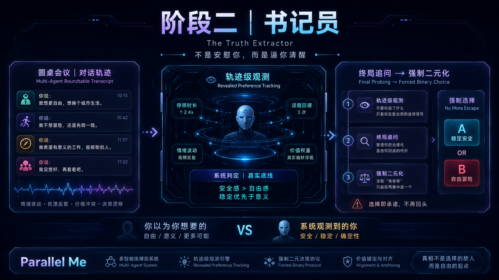

# 书记员观察与最终问询

五声说完以后，ParallelMe 不会立刻生成结论。它先判断：还有哪几个问题，如果不问清楚，最终的本心落定就会站不稳。

这一阶段是半隐藏的。书记员在后台观察圆桌，只在需要最终确认时回到台前。回到台前时，它不是简单补表格，而是用苏格拉底式诘问和黑格尔式正反合，让用户把圆桌中潜在的偏好、回避、代价和行动倾向说清楚。

## 后台观察账本

观察账本通过 `/api/scribe-observation` 更新。

它不是用户可见产品面板，不应打断圆桌、不改变当前 stage，也不暴露内部标签。失败时应静默降级。

观察账本虽然是后台对象，但仍使用严格结构化输出：当前版本为 `observation_ledger_v2`。模型必须返回可校验的观察、未回应问题和模块信号；如果结构不合格，系统先尝试修复，再进入重试或保留上一份可用账本。这里的降级只能发生在后台账本层，不能生成用户可见的模板问题。

账本关注四类核心信号：

| 模块 | 观察内容 |
| --- | --- |
| `creative_hopelessness` | 用户是否仍在寻找无代价、全满足的幻想坐标。 |
| `core_values` | 用户反复回到的价值主轴。 |
| `cost_acceptance` | 用户愿意或不愿承认的具体痛苦。 |
| `minimum_action` | 可以转化为 24 小时承诺的小动作线索。 |
| `none` | 本轮没有形成有效观察，这也是合法结果。 |

账本还会记录五声提出过、但用户没有回应的关键问题。这些问题会成为最终问询的重要素材。

## 观察规则

书记员必须：

- 观察但不下场
- 静默更新，失败不影响用户体验
- 不做临床诊断
- 不为了显得聪明强行归因
- 证据必须来自实际圆桌记录

这样设计的原因是：可见圆桌属于用户和五声，书记员只是见证者，不是隐藏裁判。

## 最终问询循环

最终问询由 `/api/alignment-inquiry` 处理。

它接收：

- 用户确认后的议题材料
- 完整圆桌记录
- 当前观察账本
- 已经问过的问题
- 用户已经回答的内容
- 可选的用户画像与品味上下文

它返回两类结果之一：

- 新的 1-3 个高密度问题
- `readyForReport: true` 与 `AlignmentProfile`

最终问询使用严格结构化输出 `inquiry_v2`。问题必须可直接展示给用户，必须包含 3-4 个自然语言选项，并保留一个自由表达选项。模型输出不合格时，系统会带着具体校验错误重新生成；连续失败时停在可重试状态，而不是用模板底题替代模型提问。

问询不设置总题量硬上限。每一轮都重新判断五个落点是否已经足够；足够时进入本心落定，不足时只追问剩余缺口。

当前成案门槛不是模型觉得能写报告，而是本地证据质量：

- 创造性无望、核心价值主轴、痛苦接纳、最小行动、正反合五个落点都必须被用户问询回答覆盖。
- 至少有 4 条问询回答。
- 至少出现一处用户自己的完整表述，不能只靠点选项落定。
- 模型即使返回 `readyForReport: true`，本地 guard 没过也会继续追问。

系统会过滤已经问过或与本轮其他问题语义过近的问询题。若模型返回重复问题，后端会用剩余落点生成新的上下文追问；如果仍然没有有效新问题，前端会停在可重试状态，而不是把“没有问题”误判成已经可以落定。

## 问询要补齐什么

最终问题服务于本心落定的五个落点：

| 落点 | 问询任务 |
| --- | --- |
| 创造性无望 | 确认哪个完美解必须被放弃。 |
| 核心价值主轴 | 确认用户真正愿意优先服务的价值。 |
| 痛苦接纳 | 确认用户能说出口并承担的具体代价。 |
| 最小行动 | 找到 24 小时内能完成的小动作。 |
| 正反合 | 把想坚持的方向与阻碍它的现实恐惧整合成用户能认领的话。 |

问询不追求问满某个数量。如果信息足够，应当提前结束；如果还有真正会改变落定质量的缺口，可以继续追问。

## 问询方法

最终问询主动使用两种方法：

- 苏格拉底式诘问：追问用户答案背后的假设、可证伪标准、真正回避的代价，以及圆桌行为暴露出的行动偏好。
- 黑格尔正反合：把“想守住的主轴”“不得不承认的反面现实”“现在愿意先做的小动作”整合成用户能认领的一句话。

这一阶段成功时，用户应该感觉不是被审问，而是越聊越明了：原本分散在五声里的冲突，被问询压成更清楚的取舍、代价和下一步。

## AlignmentProfile

`AlignmentProfile` 是中间工作对象，不是最终用户界面：

- 被证伪的幻想
- 核心价值主轴
- 被得罪的声音
- 已接纳的代价
- 拒绝承受的代价
- 未解决张力
- 正 / 反 / 合
- 用户自我陈述

它的作用是帮助书记员生成最终「本心落定」。

## 本心落定生成

最终卡片由 `/api/alignment-report` 生成，使用严格结构化输出 `alignment_report_v2`。

这一环是用户可见的最终高价值产物，因此失败策略不同于后台观察账本：系统不静默返回模板报告。每个模块必须有足够正文和至少一条证据，必须来自议题、圆桌、观察账本、最终问询和 `AlignmentProfile`。如果结构化生成、修复和校验失败，前端进入可重试状态。

这样做的原因是：一张“看似完整但没有真正被模型和用户材料支撑”的本心落定，比明确失败更伤害体验。用户应该看到的是经由圆桌和问询压实后的结论，而不是兜底文案。

## 成功标准

这一阶段成功时，系统问的是“最后一个会改变落定质量的问题”。

它失败的样子有两种：一种是对已经准备好签字的用户继续审问；另一种是用户还没有亲口承认关键代价和行动，却过早生成一张看似漂亮、实则发虚的本心落定。
