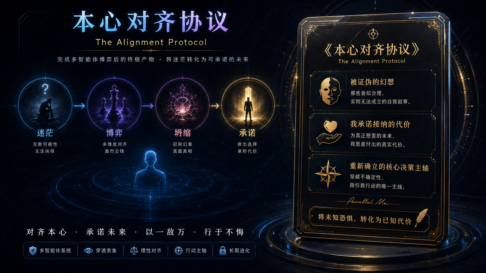

# 本心落定

本心落定是 ParallelMe 的最终用户可见产物。它不是把整场圆桌复述一遍，而是把用户现在能认领、能承担、能行动的东西压成一张卡片。

当前实现由 `/api/alignment-report` 生成，并作为 `alignment_report` 存入本地 `Meeting` 记录。

## 它要完成什么

本心落定帮助用户：

1. 对不可能的完美解死心
2. 看见表层选项下面的核心价值主轴
3. 主动承认选择该主轴所带来的具体痛苦
4. 生成一个 24 小时内能完成的小行动
5. 用正反合把冲突、恐惧、代价和方向整合为能改写的表达

## 固定模块

`HeartSettlement` 定义在 `lib/v7.ts`，schema 校验在 `lib/schema.ts`。

| 模块 | 产品含义 |
| --- | --- |
| `creative_hopelessness` | 创造性无望宣判：指出被证伪的幻想坐标。 |
| `core_value_axis` | 核心价值主轴提取：说明接下来决策服务什么。 |
| `cost_acceptance_contract` | 痛苦接纳契约：把必须承受的痛苦说成用户能认领的契约。 |
| `minimum_viable_commitment` | 最小阻力行动承诺：包含期限、动作和完成标准。 |
| `dialectic_synthesis` | 正反合：把主轴、阻碍和整合方向放在同一段可编辑文本里。 |

用户可见标题统一为「本心落定」。旧词如“清明句”“本心对齐报告”不再作为产品界面标题使用。

## 用户反馈

前四个模块支持用户反馈：

- 同意
- 不同意
- 不同意时输入自己的修正

正反合部分允许用户直接自由编辑。

这很重要：最终权威不在书记员，而在用户。归档、首页最近记录和承诺跟进都应优先使用用户自己的修正语言。

## 承诺跟进

最终行动必须小。首页可以展示近期未复盘的承诺，让用户反馈：

- 做到了
- 没做到
- 忘了
- 可选补充说明

这让 ParallelMe 不停留在漂亮的内省，而是把落定推向现实中的一个小动作。

## 归档行为

完成会议会变成本地纸页：

- 通过 Dexie / IndexedDB 存储
- 出现在最近记录中
- 可进入 archive 页面查看
- 可用于本地五声统计
- 可随本地数据一起清空

纸页不是社交内容，而是用户自己的私密记忆。

## 好的落定文案

好的本心落定应该：

- 具体，而不是漂亮空话
- 锋利，但不残忍
- 来自本次圆桌和问询证据
- 不做诊断，不写建议腔
- 允许用户反对和改写
- 小到真的能行动

## 成功标准

本心落定成功时，用户应该能说：

> 这件事仍然会疼，但我认得这是我的方向。
