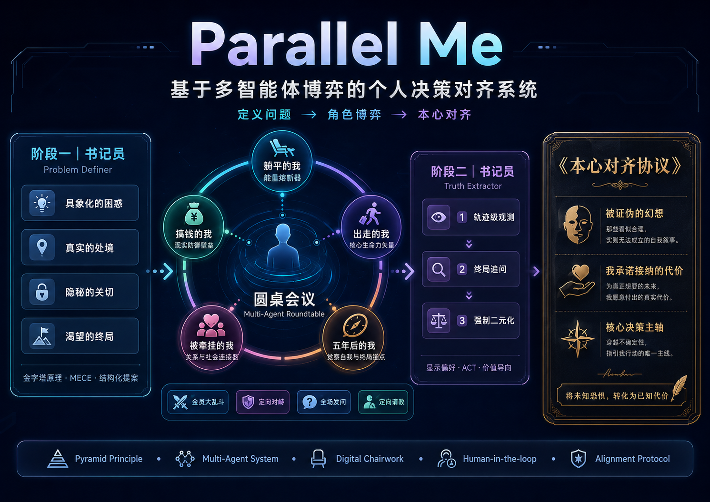

# 系统架构

本文描述 ParallelMe v1 当前代码实现。



## 技术栈

| 层级 | 技术 |
| --- | --- |
| 应用框架 | Next.js 16 App Router |
| UI | React 19 / TypeScript |
| 样式 | Tailwind CSS v4 / CSS-first design tokens |
| AI 编排 | Vercel AI SDK |
| 模型服务 | OpenAI-compatible endpoint，用户自行配置 |
| Schema 校验 | Zod |
| 客户端状态 | Zustand |
| 本地数据库 | Dexie / IndexedDB |
| 通知 | Sonner |

## 主体验入口

主流程位于 `app/meeting/page.tsx`。

它协调：

- provider 配置与 runtime payload
- stage 状态流转
- 书记员流式事件
- 议题提案确认
- 圆桌动作
- 后台观察
- 最终问询
- 本心落定生成
- 本地保存

状态管理位于 `lib/store/meeting-store.ts`。

## API 路由

| 路由 | 作用 |
| --- | --- |
| `POST /api/task-frame` | 阶段一书记员追问、议题提案生成与修正。 |
| `POST /api/roundtable` | 五声开场立论与圆桌推进。 |
| `POST /api/scribe-observation` | 用户不可见的观察账本更新。 |
| `POST /api/alignment-inquiry` | 最终高密度书记员问询。 |
| `POST /api/alignment-report` | 生成本心落定。 |
| `POST /api/taste` | 可选的品味画像提取。 |
| `POST /api/provider/test` | 模型配置连通性测试。 |

`/api/scribe-inquiry` 与 `/api/settlement` 属于旧链路或兼容接口，不是 v1 主路径。

## 核心数据对象

权威数据模型位于 `lib/v7.ts`。

| 对象 | 作用 |
| --- | --- |
| `IssueProposal` | 阶段一确认后的议题：一句主句 + 四个 Key。 |
| `TaskFrame` | 后续圆桌逻辑使用的兼容框架。 |
| `RoundtableRecord` | 五声开场、后续发言、用户动作和两声对话。 |
| `ScribeObservationLedger` | 用户不可见的观察与未回答问题记录。 |
| `AlignmentProfile` | 最终问询阶段沉淀出的中间画像。 |
| `HeartSettlement` | 最终用户可见的本心落定卡片。 |
| `Meeting` | 一次完整本地会议记录。 |

## LLM 编排

主要模型调用位于 `lib/llm.ts`。

当前模式包括：

- 从用户 provider 配置解析 OpenAI-compatible runtime
- 使用 `generateObject` / `streamObject` 生成结构化输出
- 使用 `lib/schema.ts` 中的 Zod schema 校验模型结果
- LLM 错误分类与有限重试
- 通过 SSE 包装书记员可见叙述和模型增量
- 为模型异常提供 fallback
- 阶段一追问基于 4-Key purpose 做语义去重，并在 fallback 时读取对话缺口与书记员判断过程
- 长对话与长圆桌记录在 prompt 序列化时压缩旧上下文，保留最近关键 turns
- 阶段一追问与最终问询不设置总轮次硬上限，靠足够性判断、去重和用户确认自然收束

产品原则是：JSON schema 只是传输层和校验层，不应成为用户界面的一部分。

## 本地优先存储

ParallelMe 通过 `lib/db.ts` 使用 Dexie / IndexedDB。

当前数据库名为 `ParallelMeV10`，包含 `meetings` 表，索引字段：

- `id`
- `createdAt`
- `closedAt`
- `status`

用户画像与品味上下文通过 `lib/profile.ts` 保存在浏览器 localStorage。

## 模型配置

应用接受 OpenAI API 兼容端点：

```bash
OPENAI_API_KEY=your_api_key
OPENAI_BASE_URL=https://api.openai.com/v1
OPENAI_MODEL=gpt-4o-mini
```

用户也可以在 `/setup` 页面配置模型。浏览器中的配置会随请求传给服务端 API 路由。

## 安全边界

`lib/llm.ts` 中包含危机文本检测。如果用户表达可能伤害自己或他人的风险，应用会返回安全提示，引导用户寻求现实世界支持。

产品安全边界：

- 不宣称治疗
- 不做诊断
- 不提供医疗建议
- 不替代危机干预
- 不把隐藏观察包装成权威判断
- 不替用户做最终选择

## 隐私边界

ParallelMe 是 local-first 产品：

- 会议记录保存在浏览器本地
- 不需要账号
- 本地记录可以清空
- API Key 不应进入版本库

同时也要明确：为生成模型回复，用户内容会发送给用户配置的模型服务端点。产品文案在描述隐私时应区分“本地存储”和“模型调用”。

## 开发检查

代码变更提交前建议运行：

```bash
npm run typecheck
npm run build
```

文档变更至少运行：

```bash
git diff --check
```
