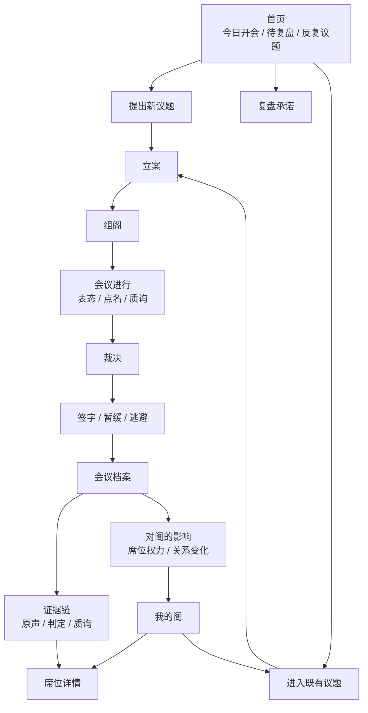

# ParallelMe V3 · 色彩与交互研究修订案

> **Revision Notice (V3 开发前定稿)**：本文已被 [`V3-IVY-FINAL-DIRECTION.md`](./V3-IVY-FINAL-DIRECTION.md) 完整吸收并增强。本文结论保留作为决策溯源。最终值（特别是 `paper.base` / 加入 `surface.deep` / 字体双轨 / 4 道用户参与门 / 反 chat 战略）以 IVY-FINAL 为准。
>
> 进一步深度调研支撑详见 `docs/research/V3/`：
> - `06-color-trends-2026.md` —— 色彩趋势完整证据
> - `09-post-chat-ai-ux.md` —— 反 chat 范式的产品哲学

> 本文针对 V3 设计的两个关键疑问做二次修订：
> 1. 当前色彩是否俗套，如何建立更专业、更一致、更高级的色彩系统。
> 2. 当前交互是否仍像线性流程，如何升级为可追溯、可管理、可复盘的会议档案系统。

---

## 1 · 外部研究结论

### 1.1 色彩：不要用“角色配色”，要用“功能色彩系统”

参考来源：

- Apple Human Interface Guidelines: color should communicate status, feedback, continuity and hierarchy; avoid relying only on color; test colors across contexts.
- Material 3: color roles are the connective tissue between UI elements and semantic meaning; roles should be tokenized and accessible.
- Munsell Color System: hue / value / chroma should be controlled separately.
- Josef Albers, Interaction of Color: color is contextual and relative, not absolute.
- Elliot / Maier color psychology reviews: real-world color psychology结论要谨慎；high chroma / red often increases arousal, brightness often maps to higher positive valence, but context dominates.

判断：

> 旧方案的问题是“给五声各挑一个颜色”，这会天然变成蓝、金、绿、红、紫的常见产品调色盘。它能分辨角色，但不够顶级，也不够“内在会议”。

V3 应改为：

> 先建立纸、墨、档案、签字、状态的语义色彩系统；席位色只作为低饱和识别符，不承担主要审美。

### 1.2 交互：不要只做“会话流程”，要做“记录型对象系统”

参考来源：

- Notion AI Meeting Notes: summary / notes / transcript 分离，用户可自定义摘要结构，会议可进入列表视图，支持筛选、搜索、分组。
- Granola AI-enhanced notes: AI 生成的笔记可以追溯到原 transcript 或 raw notes。
- Jira Incident Timeline: 事件 timeline 展示整个历史，包括更新、变更、评论，并支持复盘。
- Atlassian Issue View: activity feed 将 changes / updates / comments 作为问题对象的一部分。
- Linear Timeline: 高层计划和粒度执行分离，避免一个视图承载所有复杂度。
- FigJam / Slack Canvas: 会议不只是记录，而是带有 agenda、actions、participants、links 的协作表面。

判断：

> 当前 V3 交互仍偏“线性仪式流程”。这很好，但还不够像一个长期产品。真正的“阁”需要三个对象层级：议题、会议、阁。每个会议内部还要分 summary / transcript / decisions / actions / evidence。

V3 应改为：

> 会议进行时是仪式；会议结束后必须变成可检索、可追溯、可复盘、可反向更新席位的档案对象。

---

## 2 · 色彩系统修订

### 2.1 新色彩命题

旧命题：

> 纸面上的私人会议室。

保留，但补一句：

> **墨色定秩序，矿物色定席位。**

这意味着：

- 大部分界面由纸和墨构成。
- 颜色不负责“漂亮”，只负责“席位识别、状态变化、签字行为、情绪强度”。
- 所有席位色降低 chroma，避免像五张彩色贴纸。

### 2.2 新基础色板

| Token | Hex | 用途 | 说明 |
|---|---|---|---|
| `paper.base` | `#F7F0E3` | 页面背景 | 比原来更少奶油感，更像旧纸 |
| `paper.lift` | `#FFFCF5` | 议案纸 / 主内容 | 保持阅读亮度 |
| `paper.sunk` | `#EDE2D0` | 次级区域 / 档案层 | 用 value 差建立层级 |
| `paper.edge` | `#D8CBB8` | 细线 / 纸边 | 温和但可见 |
| `ink.core` | `#191713` | 主文字 / 主 CTA | 不用纯黑 |
| `ink.body` | `#3C3932` | 正文 | 长读舒适 |
| `ink.mute` | `#7C7568` | 侧记 / meta | 档案感 |
| `ink.faint` | `#B7AC9B` | disabled / quiet | 沉默状态 |

### 2.3 新功能色

| Token | Hex | 用途 |
|---|---|---|
| `seal.action` | `#8E3F32` | 签字、确认、被流放席警示 |
| `seal.soft` | `#CFAFA5` | 签字印迹背景 |
| `gold.attention` | `#A8844D` | 转正、等待处理、重点标记 |
| `green.safe` | `#536E5A` | 完成、已执行、低风险 |
| `blue.trace` | `#455F70` | 可追溯引用、证据链 |

### 2.4 新席位色：矿物低饱和

席位色不再追求“鲜明好看”，而是像档案里不同颜色的细线、标签、蜡笔标记。

| 席位 | 新名 | Hex | 情绪温度 | 使用方式 |
|---|---|---|---|---|
| 躺平的我 | 休整席 | `#556F7A` | 冷、低唤醒 | 点、线、左边框 |
| 搞钱的我 | 资源席 | `#8A6F3D` | 暖、稳定 | 点、线、票据标记 |
| 出走的我 | 自由席 | `#3F6B5A` | 冷中带生机 | 点、路线、入席线 |
| 讨妈欢心的我 | 依恋席 | `#8C5042` | 暖、亲缘 | 点、侧记、关系线 |
| 5 年后的我 | 远望席 | `#5E5369` | 冷、远、深 | 点、时间线、裁决引用 |
| 临时席 | 临时席 | `#76684D` | 中性、未定 | 虚线边框 |
| 沉默席 | 沉默席 | `#899199` | 冷灰、低存在 | 低透明度 |
| 被流放席 | 被流放席 | `#6F3F35` | 暗暖、高敏感 | 小面积，不能满屏 |

### 2.5 使用比例

```
纸/墨/线：88%
席位识别色：8%
签字/状态色：4%
```

这比旧方案更克制。

旧方案像“角色卡片系统”。  
新方案像“私人档案系统”。

### 2.6 色彩规则

1. **正文永远不用席位色。**  
   席位色只用于头像点、边框、短标签、关系线。

2. **主 CTA 永远用墨色或签字色。**  
   不要每个席位都拥有自己的 CTA 颜色。

3. **临时席只用虚线和中性色。**  
   因为它还没进入用户长期结构。

4. **被流放席不能用大面积红。**  
   只用暗陶土小标记，避免强化威胁感。

5. **所有状态同时有文字。**  
   不靠颜色单独表达：常任、临时、沉默、被流放、等待转正必须写出来。

---

## 3 · 交互系统修订

### 3.1 旧交互的问题

当前 V3 流程：

```
立案 → 组阁 → 表态 → 点名 → 质询 → 裁决 → 签字 → 档案
```

问题：

1. **流程强，但对象弱。**  
   用户知道现在在哪一步，但不一定知道这次会议将来如何被查找、复盘、调用。

2. **会议强，但阁的管理入口弱。**  
   组阁页出现了席位，但用户对席位的长期管理还不够前置。

3. **AI 输出的可追溯性弱。**  
   Granola 和 Notion 都强调 summary 和 transcript 的关联。我们的 NowMe 裁决、书记侧记、席位变化也必须能追溯到具体发言/质询/用户判定。

4. **不同议题之间的关系弱。**  
   用户未来会问：“这次考公，和我上次分手纠结是不是同一种模式？”  
   当前结构还没把跨会议关系放出来。

### 3.2 新的信息层级

V3 应有四层对象：

```
阁 Cabinet
  └─ 议题 Issue
       └─ 会议 Meeting
            ├─ 席位发言 Turns
            ├─ 质询 Cross-exams
            ├─ 用户判定 User marks
            ├─ 裁决 Verdict
            ├─ 承诺 Commitment
            └─ 证据链 Evidence
```

解释：

- **阁** 是长期组织。
- **议题** 是一个反复出现的人生问题，例如「考公与妈妈期待」。
- **会议** 是某一天围绕该议题开的具体会议。
- **证据链** 让所有总结、侧记、席位变化都能追溯回原始发言。

### 3.3 新首页结构

首页不能只有输入框。

应分成三层：

1. **今日开会**  
   主输入：今天要开什么会？

2. **待复盘**  
   上次签字的承诺：做了吗？

3. **正在反复出现的议题**  
   例如：
   - 妈妈期待与自由
   - 工作身份与身体疲惫
   - 亲密关系里的退缩

这样首页就从「新建聊天」变成「进入你的阁」。

### 3.4 新会议详情结构

会议结束后的档案不应该是普通历史详情。

应采用：

```
顶部：议题 / 日期 / 状态 / 签字结果

左列：会议摘要
  - 本次组阁
  - 投票结果
  - 最尖锐质询
  - 裁决
  - 承诺

右列：证据链
  - 发言原文
  - 用户点名
  - 质询问答
  - 用户判定

底部：对阁的影响
  - 谁变强
  - 谁被压住
  - 哪个临时席进入等待转正
```

移动端：

```
摘要
证据
影响
```

用 tabs，但 tab 名称不要工具化：

- 摘要
- 原声
- 余波

### 3.5 新“我的阁”结构

我的阁不应该只是席位列表。

应该像一个可管理的私人组织：

```
我的阁
├─ 总览
│  ├─ 本周掌权
│  ├─ 最近沉默
│  ├─ 等待转正
│  └─ 最近反复出现的议题
├─ 席位
│  ├─ 常任席
│  ├─ 临时席
│  ├─ 沉默席
│  └─ 被流放席
├─ 议题
│  ├─ 反复议题
│  ├─ 已签字议题
│  └─ 暂缓议题
└─ 档案
   ├─ 会议列表
   ├─ 承诺列表
   └─ 侧记
```

### 3.6 新交互原则

1. **会议进行时：强仪式、低复杂度。**  
   一次只让用户处理当前阶段。

2. **会议结束后：高可追溯、可检索。**  
   档案必须让用户回到任何一次发言和判定。

3. **首页：不是空白新建页，而是阁的入口。**  
   新议题、待复盘、反复议题要同时存在。

4. **席位变化必须有证据。**  
   系统说「怕选错的我变强」，必须能展开看到原因。

5. **复杂关系只在用户需要时展开。**  
   不把关系图、时间线、证据链同时塞进会议进行页。

---

## 4 · 修订后的核心交互图



---

## 5 · 修订后的页面优先级

### 第一批高保真

1. 首页：今日开会 + 待复盘 + 反复议题。
2. 立案 / 组阁：保持强仪式。
3. 会议进行：阶段式，不暴露复杂档案结构。
4. 裁决签字：高情绪峰值。
5. 会议档案：摘要 / 原声 / 余波。
6. 我的阁：总览 / 席位 / 议题 / 档案。

### 第二批

1. 席位详情。
2. 议题详情。
3. 证据链展开。
4. 临时席转正。
5. 周度侧记。

---

## 6 · 最终判断

### 色彩判断

旧色板可以用，但不顶级。  
它的俗套来自“五个角色五种颜色”的直接映射。

新色板应该转向：

> 低饱和矿物色 + 温纸 + 墨色秩序 + 小面积签字色。

这更符合私密、长期、档案、内在会议的产品气质。

### 交互判断

旧交互的方向是对的，但仍然太像一次性体验。  
它需要升级为：

> 会议时是仪式，会议后是档案，档案再反哺阁。

这才支撑“阁是可管理、可调用、有记忆的”。

---

## 7 · 参考来源

- Apple Human Interface Guidelines · Color: https://developer.apple.com/design/human-interface-guidelines/color
- Material 3 Color Roles and Tokens: https://developer.android.com/design/ui/wear/guides/styles/color/roles-tokens
- Munsell colour system · Britannica: https://www.britannica.com/science/Munsell-color-system
- Josef & Anni Albers Foundation · Interaction of Color: https://www.albersfoundation.org/alberses/teaching/interaction-of-color
- Elliot, A. J. · Color and psychological functioning: https://pmc.ncbi.nlm.nih.gov/articles/PMC4383146/
- Notion AI Meeting Notes: https://www.notion.com/help/ai-meeting-notes
- Notion Developers · Meeting notes block structure: https://developers.notion.com/guides/data-apis/working-with-page-content
- Granola AI-enhanced notes: https://docs.granola.ai/help-center/taking-notes/ai-enhanced-notes
- Jira Incident Timeline: https://support.atlassian.com/jira-service-management-cloud/docs/what-is-the-incident-timeline/
- Atlassian Issue View · Activity feed: https://developer.atlassian.com/cloud/jira/platform/issue-view/
- Linear Timeline: https://linear.app/docs/timeline

