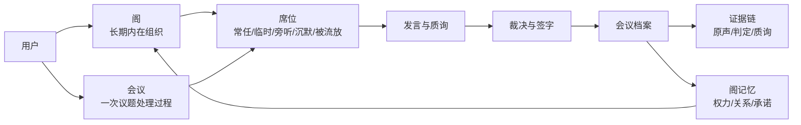
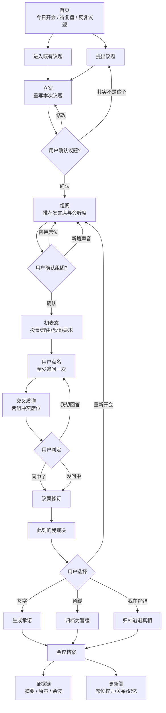
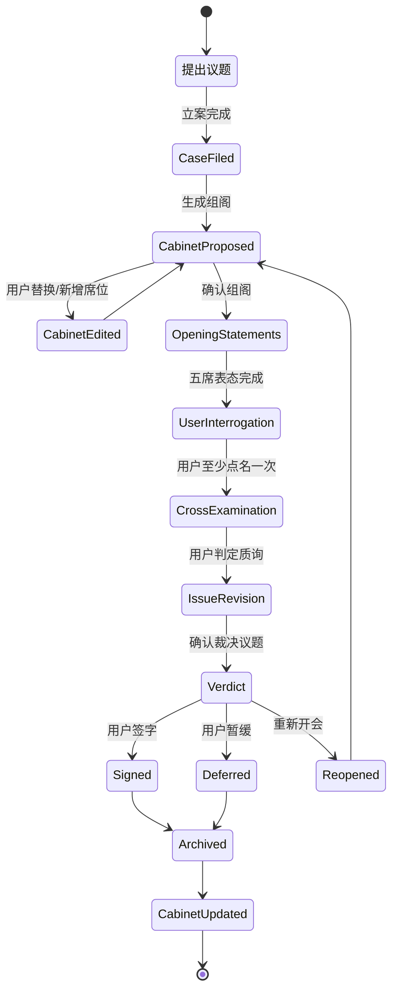
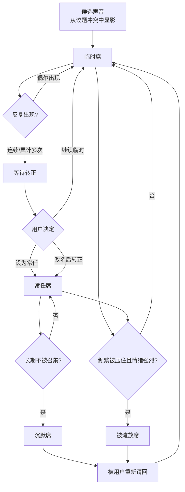
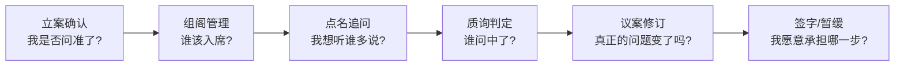

# ParallelMe V3 · UI 美学方案与交互逻辑

> **Revision Notice (V3 开发前定稿)**：本文部分章节已被 [`V3-IVY-FINAL-DIRECTION.md`](./V3-IVY-FINAL-DIRECTION.md) 收束修订：
> - 第 3 节 色彩 → 见 IVY-FINAL § 2.1（`paper.base #F4F1EC`、新增 `surface.deep #1A1816`、比例 78/14/5/3）
> - 第 4 节 字体 → 见 IVY-FINAL § 2.2（双轨：Geist + Source Han Serif SC + Geist Mono；CJK letter-spacing = 0；禁用 fluid 大字）
> - 材质语言（Liquid Glass 取舍） → 见 IVY-FINAL § 2.3（借 translucency/depth，拒 refraction，参考 Linear ProKit 路径）
> - 第 5 节 组件 → 见 IVY-FINAL § 2.4（P0/P1/P2 优先级）
>
> 冲突时以 IVY-FINAL 为准。本文保留作为详细页面方案与交互逻辑关系的工作稿。

> 目标：把「内在组阁系统」从产品概念落成可执行的界面语言、页面方案和交互状态图。
> 本文不讨论技术实现，只定义顶级 UI、美学方向、页面结构、组件语言和交互逻辑关系。

---

## 1 · 设计总命题

V3 的界面不是聊天框，不是仪表盘，不是心理测试。

它应该像：

> **纸面上的私人会议室。**

用户不是来和 AI 聊天，而是来主持一场只属于自己的内在会议。

因此界面必须让用户在 3 秒内感到：

- 这里不是「问 AI」。
- 这里是在「立案」。
- 我不是旁观者，我是主持人。
- 这些声音不是随机角色，它们是我的内在席位。
- 每一次会议都会留下档案，并改变我的阁。

---

## 2 · 美学原则

### 2.1 关键词

- 纸面
- 圆桌
- 席位
- 侧记
- 档案
- 签字
- 克制
- 私密
- 仪式
- 留白

### 2.2 不要做成

- AI 工具站
- SaaS Dashboard
- 心理测试 H5
- 赛博聊天窗口
- 过度疗愈风 app
- 华丽但空洞的渐变页

### 2.3 视觉隐喻

| 产品对象 | 视觉隐喻 | UI 表达 |
|---|---|---|
| 议题 | 议案纸 | 大字号标题、可编辑纸面 |
| 席位 | 名牌 / 席卡 | 稳定尺寸小卡，像桌边名牌 |
| 组阁 | 入席名单 | 常任席、临时席、旁听席分区 |
| 会议 | 圆桌 / 会议纸 | 中央议题，席位围绕 |
| 点名 | 主持人发问 | 当前席位高亮，底部发言区 |
| 质询 | 交叉问答 | 两席对峙，中间问题线 |
| 裁决 | 决议纸 | 正文式排版，不用气泡 |
| 签字 | 签字线 / 印章 | 轻微墨印动效 |
| 档案 | 文件夹 / 纸页 | 时间、议题、裁决、承诺 |
| 阁 | 私人档案室 | 席位状态、关系、权力变化 |

---

## 3 · 色彩系统

V3 色彩不再采用「五个角色五种颜色」的直觉式搭配。那样虽然易懂，但容易变成常见的蓝、金、绿、红、紫角色卡片系统。

新原则：

> **墨色定秩序，矿物色定席位。**

大面积界面由纸、墨、线构成；席位色只作为低饱和识别符，用于点、线、边框和短标签。

### 3.1 基础色

| Token | Color | 用途 |
|---|---|---|
| Paper Base | `#F7F0E3` | 页面底色 |
| Paper Lift | `#FFFCF5` | 议案纸 / 主内容 |
| Paper Sunk | `#EDE2D0` | 次级区域 / 档案层 |
| Paper Edge | `#D8CBB8` | 细线 / 纸边 |
| Ink Core | `#191713` | 主文字 / 主 CTA |
| Ink Body | `#3C3932` | 正文 |
| Ink Mute | `#7C7568` | 侧记 / meta |
| Ink Faint | `#B7AC9B` | disabled / quiet |

### 3.2 席位色

色彩只用于识别席位，不大面积铺底。

| 席位 | Color | 气质 |
|---|---|---|
| 休整席 / 躺平 | `#556F7A` | 雨石蓝、低消耗 |
| 资源席 / 搞钱 | `#8A6F3D` | 旧铜金、现实 |
| 自由席 / 出走 | `#3F6B5A` | 杜松绿、出口 |
| 依恋席 / 讨妈 | `#8C5042` | 茜土色、亲缘 |
| 远望席 / 5 年后 | `#5E5369` | 烟紫、时间 |
| 临时席 | `#76684D` | 茶褐、未定 |
| 沉默席 | `#899199` | 石灰蓝、轻退场 |
| 被流放席 | `#6F3F35` | 暗陶土、被压住 |

### 3.3 色彩比例

```
纸 / 墨 / 线：88%
席位识别色：8%
签字 / 状态色：4%
```

这个比例保证页面不变成一盘彩色卡片。

补充规则：

- 正文永远不用席位色。
- 主 CTA 永远用墨色或签字色。
- 临时席用虚线边框和中性色，不用强色。
- 被流放席只用小面积暗陶土，避免制造威胁感。
- 所有状态必须同时有文字，不靠颜色单独表达。

---

## 4 · 字体与排版

### 4.1 字体策略

| 场景 | 字体气质 |
|---|---|
| 大标题 | 宋体 / 思源宋体 / Songti SC |
| 正文 | PingFang SC / system sans |
| 标签 | Sans，小号，字距略开 |
| 决议正文 | 宋体标题 + Sans 正文 |
| 侧记 | 小号衬线或 italic |

### 4.2 字阶

| Token | Desktop | Mobile | 用途 |
|---|---:|---:|---|
| Display | 56-72 | 38-46 | 首页主标题 |
| H1 | 36-44 | 30-34 | 阶段标题 |
| H2 | 24-30 | 22-26 | 区块标题 |
| Body | 16-18 | 15-16 | 正文 |
| Small | 12-13 | 12 | 标签、状态 |

原则：

- 不用 viewport width 缩放字体。
- 长文本永远先保证阅读，不追求装饰。
- 标签短，正文重，侧记轻。

---

## 5 · 核心组件

### 5.1 议案纸 `DocketPaper`

用于立案、议题确认、裁决。

属性：

- 纸面背景。
- 细线边框。
- 左上角阶段标签。
- 右侧可有侧记。
- 可编辑态要像在纸上改字，不像表单。

### 5.2 席位名牌 `SeatNameplate`

用于组阁和会议。

内容：

- 席位名
- 常任 / 临时 / 旁听 / 沉默 / 被流放
- 保护对象
- 入席理由
- 风险

状态：

- 普通
- 当前发言
- 被质询
- 用户点名
- 被放下
- 被采纳

### 5.3 阶段轨 `StageRail`

显示会议流程。

阶段：

```
立案 → 组阁 → 表态 → 点名 → 质询 → 裁决 → 签字
```

要求：

- 用户永远知道当前阶段。
- 已完成阶段要轻，不抢主内容。
- 当前阶段要清晰，不要闪烁。

### 5.4 会议桌 `CabinetTable`

桌面端核心视觉。

结构：

- 中央是议题纸。
- 五个发言席围绕。
- 旁听席在外圈。
- 当前发言席以细线连接中央议题。

移动端不强行圆桌，改为：

- 当前发言主卡。
- 席位横向条。
- 阶段轨固定在顶部。

### 5.5 侧记 `Marginalia`

用于系统观察，而不是 AI 说教。

例子：

> 书记侧记：这次「怕选错的我」第一次入席。

侧记规则：

- 短。
- 不诊断。
- 不抢用户主权。
- 像纸边批注。

### 5.6 签字条 `SignatureSlip`

用于裁决结束。

内容：

- 24 小时动作。
- 签字按钮。
- 暂缓出口。
- 我在逃避出口。

签字后：

- 轻印章。
- 生成档案编号。

---

## 6 · 页面方案

### 6.1 首页 · 会议入口

目标：

> 用户一进来就知道：这里不是聊天，是开会。

布局：

```
顶部导航：会议 · 我的阁 · 档案 · 底片

主标题：
今天要开什么会？

副文案：
写下那个没人能替你决定的议题。

中央：
大输入纸

底部：
最近一次会议 callback / 今日轻提示
```

核心动作：

- `提交议题`

审美：

- 大留白。
- 输入区像纸，不像文本框。
- 不展示五个角色头像，避免一开始变成固定模板。

### 6.2 立案页

目标：

> 帮用户把混乱输入问准。

布局：

```
原始输入
↓
本次议题
↓
三个核心冲突
↓
确认动作
```

用户动作：

- 就按这个开会
- 改一下议题
- 其实不是这个

设计重点：

- 议题必须可编辑。
- 核心冲突要像纸边标签。
- 这一步不能像 loading 结果，而要像共同立案。

### 6.3 组阁页

目标：

> 用户看到本次五席是为这个议题临时组成的。

布局：

```
本次组阁

发言席
5 张席位名牌

旁听席
0-3 张轻量席位名牌

操作
确认组阁 / 替换席位 / 新增声音
```

席位卡信息：

```
怕选错的我 · 临时席
请它入席：你纠结了半年，真正困住你的可能是不可逆感。
它保护：你不被一个错误选择毁掉。
风险：它会让你永远停在比较里。
```

### 6.4 会议进行页

目标：

> 让用户像主持人，而不是观众。

桌面布局：

```
左上：阶段轨
中央：会议桌
右侧：当前发言 / 质询
底部：用户发言与点名操作
```

移动端布局：

```
顶部：阶段轨 + 议题
中间：当前席位发言
下方：席位横向条
底部：用户操作
```

关键规则：

- 初表态结束后必须停。
- 用户至少点名一次才能进入质询。
- 每个席位发言使用结构化格式，不一开始输出长散文。

### 6.5 质询页 / 质询状态

目标：

> 把「互怼」升级为有程序的交叉质询。

布局：

```
左席位       中央质询问题       右席位
发问者  →  问题 / 回应  ←  被问者

用户判定：
问中了 / 没问中 / 我想回答
```

设计重点：

- 强对峙，但不吵闹。
- 问题要居中，像被放在会议桌中央。
- 用户判定必须显眼。

### 6.6 裁决与签字页

目标：

> 把结论变成用户自己的承诺动作。

布局：

```
会议决议

我听见了什么
我决定暂时听谁
我决定暂时不听谁
我承认代价
接下来 24 小时

签字区
```

按钮：

- 签字
- 暂缓
- 重新开会
- 我在逃避

审美：

- 像一张决议纸。
- 不用气泡。
- 签字完成有轻印章。

### 6.7 我的阁

目标：

> 让用户看见自己的内在组织正在形成。

首屏：

```
本周掌权
最近沉默
最常问中
等待转正
```

主体：

- 常任席
- 临时席
- 沉默席
- 被流放席
- 席位关系

视觉：

- 像私人档案室，不像数据看板。
- 权力变化用文字 + 轻量图形表达。

---

## 7 · 交互逻辑关系

V3 的交互不只是一次线性会议。会议进行时要低复杂度、强仪式；会议结束后要变成可检索、可追溯、可复盘的档案对象，并反向更新用户的阁。

新对象层级：

```
阁 Cabinet
  └─ 议题 Issue
       └─ 会议 Meeting
            ├─ 席位发言 Turns
            ├─ 质询 Cross-exams
            ├─ 用户判定 User marks
            ├─ 裁决 Verdict
            ├─ 承诺 Commitment
            └─ 证据链 Evidence
```

### 7.1 核心对象关系



### 7.2 主流程



### 7.3 会议状态机



### 7.4 席位生命周期



### 7.5 用户参与节点



---

## 8 · 微交互

### 8.1 入席

席位卡轻轻落到会议纸边，不弹跳。

文案：

> 「怕选错的我」入席。

### 8.2 点名

用户点名时，该席位名牌墨色加深，其他席位退半级。

文案：

> 主持人点名：怕选错的我。

### 8.3 问中

用户点击「问中了」时，质询问题被记入档案。

视觉：

- 问题下方出现一条细线。
- 右侧侧记出现：已记入本次档案。

### 8.4 签字

签字后出现轻印章，不要大动画。

文案：

> 已签字。不是完美答案，是先走一步。

### 8.5 阁更新

会议结束后不要直接弹复杂报告。

只给一条侧记：

> 这次会议后，「怕选错的我」成为新的临时席。它已经出现 1 次。

---

## 9 · 设计优先级

第一批必须设计到高保真逻辑的页面：

1. 会议首页
2. 立案页
3. 组阁页
4. 会议进行页
5. 裁决签字页
6. 我的阁

第二批：

1. 席位详情
2. 档案详情
3. 周度侧记
4. 临时席转正弹层

---

## 10 · 设计验收标准

### 10.1 第一眼

用户看到首页，应能说：

> 这是一个开会的地方，不是聊天框。

### 10.2 第一次组阁

用户看到组阁页，应能说：

> 它真的根据我的问题请了这些声音。

### 10.3 第一次点名

用户完成点名后，应能说：

> 我不是只在看输出，我在主持。

### 10.4 第一次签字

用户签字后，应能说：

> 它没有替我决定，是让我承认我先走哪一步。

### 10.5 第一次看「我的阁」

用户看到我的阁后，应能说：

> 原来这个产品记住的不是聊天记录，而是我的内在组织。
