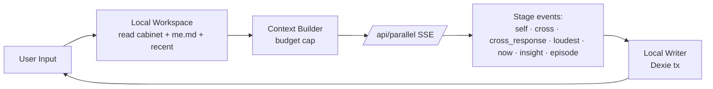

# ParallelMe · 技术架构

> 这份文档定义 ParallelMe 的工程实现方向。
> 命题：**轻便 + 服务设计**——能用 React 18 + Next.js 14 + 原生 fetch + IndexedDB 解决的，不引入大框架。
> 配套 `PRODUCT-DESIGN.md`。冲突时以 `PRODUCT-DESIGN.md` 为准。

---

## 0 · 总命题

工程目标只有两个：

1. **减少代码量、减少依赖、减少抽象**
2. **每一行代码都必须服务于某条产品决策**——技术决策不为"工程优雅"，只为"产品形态稳定地落到屏幕上"

"轻便"不是代码少，而是**复杂度可被一个人在一个下午看懂**。

---

## 1 · 八条技术原则

```
1. Local first, cloud optional      本地可完整使用，云同步以后再作为增强
2. Workspace before account         先有本地工作区，再有账号同步
3. Inspectable memory               记忆必须能看 / 能改 / 能删 / 能导出
4. Evidence before insight          长期洞察必须有证据链
5. Stateless server                 API route 只做编排和转发，不成为用户数据中心
6. Setup is product                 Provider 引导是首次信任建立
7. Actor mode stays                 没 key 也能体验，但必须清楚标注
8. Token-driven, no inline styles   一切色彩 / 字体 / 间距 / 动效 / 圆角走 token
```

---

## 2 · 总体架构

### 2.1 · 分层

```text
┌─────────────────────────────────────────────────────────┐
│  Browser (Fat Client)                                    │
│  ┌─────────────────────────────────────────────────┐    │
│  │  UI Layer · React + Tokens                       │    │
│  │  ────────────────────────────────────────────    │    │
│  │  Local Workspace · Dexie / IndexedDB             │    │
│  │  ────────────────────────────────────────────    │    │
│  │  Context Builder · select memories + cabinet     │    │
│  └────────────────────────┬────────────────────────┘    │
└──────────────────────────────│───────────────────────────┘
                               │
                               ▼
                      /api/parallel (SSE)
                      /api/followup
                      /api/provider/test
                      ─────────────────────
                      Stateless edge handler
                      No DB · No user state
                               │
                               ▼
                      LLM Provider
                  (DeepSeek / OpenAI-compatible
                   / 自部署 Ollama / Anthropic 选配)
```

### 2.2 · 边界规则

- 服务端**永远不写数据库**
- 服务端**永远不保留用户输入**
- 服务端**永远不保留 API Key**
- 服务端的存在感越低，产品越成功

### 2.3 · 数据流



---

## 3 · 依赖（V0.5 实际栈）

```json
{
  "dependencies": {
    "geist": "^1.4.0",
    "next": "14.2.15",
    "react": "18.3.1",
    "react-dom": "18.3.1",
    "dexie": "^4.4.2",
    "dexie-react-hooks": "^4.4.0"
  },
  "devDependencies": {
    "tailwindcss": "3.4.17",
    "autoprefixer": "...",
    "postcss": "...",
    "typescript": "5.4.5"
  }
}
```

**4 个 runtime 依赖** + **4 个 dev 依赖**。这是项目的硬约束——任何新依赖必须证明产品价值。

不引入：
- 任何 ORM（Dexie 已经够）
- 任何状态管理（useLiveQuery + React state 够用）
- 任何 UI 组件库（视觉特定，重写比改装快）
- 任何 motion 库（CSS transition 够用 99% 场景）
- ChakraUI / shadcn / Material UI

---

## 4 · LLM Provider 抽象

### 4.1 · 设计目标

必须同时支持：
- 用户在浏览器粘贴 key（最常见路径）
- 自部署用户用环境变量（开发者）
- 没 key 用户用演员模式（体验）

### 4.2 · Runtime Config

```ts
// lib/llm.ts
const ENV_API_BASE = process.env.OPENAI_BASE_URL || "https://api.openai.com/v1";
const ENV_API_KEY = process.env.OPENAI_API_KEY || "";
const ENV_MODEL = process.env.OPENAI_MODEL || "gpt-4o-mini";

export interface LlmRuntime {
  baseUrl?: string;
  model?: string;
  apiKey?: string;
}

function resolveRuntime(rt?: LlmRuntime) {
  return {
    apiKey: rt?.apiKey || ENV_API_KEY,
    baseUrl: rt?.baseUrl || ENV_API_BASE,
    model: rt?.model || ENV_MODEL,
  };
}

function hasRealKey(rt?: LlmRuntime): boolean {
  return !!resolveRuntime(rt).apiKey;
}
```

所有 9 个 export function（`callSelf` / `crossExamine` / `crossExamRespond` / `pickOpposingPairs` / `callNowMeWithCritic` / `followUp` / `psychInsight` / `extractEpisode` / `extractTasteProfile`）都接受可选 `runtime?: LlmRuntime` 参数。

不传 → fall back to env。传 → 用户 key 优先。这让 V0.5 实施时能渐进迁移：客户端 `/api/parallel` 把 `provider` 从 request body 解析后传给所有内部调用，自动绕过 env。

### 4.3 · 安全规则

- API Key 永远不进 console.log / error reporting
- API Key 永远不进 SSE event
- API Key 永远不进 export
- UI 永远只显示 `sk-***...***xx` masked 形态

### 4.4 · Provider Setup Wizard

`/setup` 5 步引导：选服务商 → 填 key/baseUrl/model → 一键测试 → 选保存方式 → 完成。

```ts
// lib/provider.ts
export type ProviderType = "deepseek" | "openai" | "openai-compatible" | "mock";

export const PRESETS: Record<ProviderType, ProviderPreset> = {
  deepseek: { baseUrl: "https://api.deepseek.com/v1", model: "deepseek-chat", ... },
  openai:   { baseUrl: "https://api.openai.com/v1",   model: "gpt-4o-mini",  ... },
  ...
};
```

存储位置由 `apiKeyRef` 决定：`browser` (localStorage) / `session` (sessionStorage) / `env` (`.env.local`)。

`/api/provider/test` 是无状态 endpoint：转发 5-token 请求验证 key，**不持久化**，15 秒超时。

---

## 5 · 多 Agent Orchestration

### 5.1 · 选型决策

V0.5 的选择：**自写 SSE 状态机 + Vercel AI SDK 局部能力**。

理由：
- ParallelMe 的"会议状态机"是产品独特性，不应该被通用 agent loop 抽象
- Vercel AI SDK 5 的 Agent abstraction / prepareStep 在 stage 级编排上有用，但**全量切到** SDK 增加 60KB 包体且改造成本高
- Anthropic Agent SDK 强绑定 Anthropic，与 multi-provider 矛盾

具体怎么用：
- 会议主链路：自写 SSE
- 每阶段内部并行（5 路 selves）：可用 `streamText` 简化 abort 控制
- prompt caching：直接调 Anthropic 原生 API（如果切到 Anthropic provider）

### 5.2 · SSE 状态机化

V0.5 的 `/api/parallel` 是**单次 long-running SSE**，覆盖整个会议：

```
POST /api/parallel { input, mode: "quick"|"full", provider, context }
↓ SSE events:
  data: {"type":"self", id, name, text}                          × 3 or 5
  data: {"type":"cross", fromId, from, toId, to, text}            × 4 (full only)
  data: {"type":"cross_response", fromId, from, text}             × 4 (full only, V0.5 new)
  data: {"type":"loudest", id}
  data: {"type":"now", text}
  data: {"type":"insight", text}
  data: {"type":"episode", ep}
  data: {"type":"done"}
```

客户端把所有事件 push 到 timeline，但 stage gates buffer 部分事件（cross / cross_response / verdict / insight）直到用户走完 interrogation 才显示——避免 spoiler。

### 5.3 · GAN-inspired Harness

`callNowMeWithCritic` 实现反讨好的 GAN 范式：

```
NowMe v1 (生成)
  ↓
violatesBan(text) — 检测禁用词清单
  ↓
若违规 → NowMe v2 (重写时显式告知违规词)
若合规 → 输出
```

禁用词在 `BAN_WORDS` 常量中维护，`lib/llm.ts`。

### 5.4 · Cross-Exam Real Dialogue（V0.5 新）

每个 cross 后立即 `crossExamRespond()` 让被问席用 ≤60 字回应：

```ts
const messages = [
  {
    role: "system",
    content: targetSeat.system_prompt +
      `\n\n# 特殊任务：被质询时的回应\n「${challenger.name}」刚刚反问了你。\n` +
      "用 ≤ 60 字诚实回应。继续保持你的人格、口头禅、禁忌词。\n" +
      "不要被说服转向，但也不要无脑反驳——把你真实的反应说出来。",
  },
  { role: "user", content: `用户的纠结：${input}\n\n${challenger.name}质问你：「${challenge}」\n\n你的一句话回应：` }
];
```

事件序列严格交替（实测）：`cross → cross_response → cross → cross_response → ...`

### 5.5 · Prompt Caching 策略（V0.6+）

仅在 Anthropic provider 时启用。结构：

```ts
// 静态 prefix（可缓存）
[
  systemPrompt,        // ← cache_control: { type: "ephemeral", ttl: "5m" }
  cabinetBrief,        // ← cache_control: { type: "ephemeral", ttl: "1h" }
  // 动态部分（不缓存）
  recentMessages,
  userInput,
]
```

预期收益：缓存读 base × 0.1（90% 折扣），单次完整内阁会议成本 -60%。

DeepSeek / OpenAI 暂无对等机制，但 LlmRuntime 抽象层**预留 caching 字段**，未来无缝启用。

---

## 6 · 本地工作区（Dexie）

### 6.1 · 选型对比

| 库 | 体积（gzip） | 决策 |
|---|---:|---|
| `localStorage` | 0 | V2 用，仅 fallback |
| `idb-keyval` | 1.1KB | 太弱，不能查询 |
| **`Dexie.js`** | **14KB** | **主选** |
| `RxDB` | 62KB | 过度，60KB 包体过大 |
| WASM SQLite | ~1MB | 完全过度 |

**理由**：Dexie 提供 declarative schema + live queries + TS 一流支持，恰好命中 ParallelMe 单用户单设备 + 数百到数千 meetings + 按 issue/seat/date 查询的需求。

### 6.2 · Schema（V0.5 实际）

```ts
// lib/db.ts
class CabinetDB extends Dexie {
  meetings!: Table<Meeting, string>;

  constructor() {
    super("ParallelMeV3");  // 名字保留 (legacy compatibility，避免破坏现有用户的 IndexedDB)
    // v1: initial Quick Meeting schema
    // v2: + crossExams[] / userMarks[] / topicRevised
    // v3: + commitmentFollowup
    this.version(3).stores({
      meetings: "id, createdAt, closedAt, status, mode",
    });
  }
}
```

单表 denormalized Meeting，包含全部子结构：

```ts
interface Meeting {
  id: string;
  createdAt: number;
  closedAt?: number;
  status: "in_progress" | "signed" | "paused" | "escaped" | "abandoned";
  mode: "quick" | "full";

  topicRaw: string;
  topicRefined?: string;
  topicRevised?: string;            // 立案后修订
  verdictBasedOn?: "original" | "revised" | "both";

  seatIds: SelfId[];
  turns: MeetingTurn[];
  followups: MeetingFollowup[];
  crossExams?: CrossExam[];          // full mode only
  userMarks?: UserMark[];            // full mode only

  verdict?: MeetingVerdict;
  signature?: MeetingSignature;
  memoryConsent?: MemoryConsentRecord;
  commitmentFollowup?: CommitmentFollowup;  // Loop A
}
```

cross-cutting Cabinet/Seat/Issue 表**未引入**——V0.5 通过派生计算（`lib/cabinet.ts`）从 meetings 聚合。

### 6.3 · 派生层（lib/cabinet.ts）

```ts
export async function aggregateSeatStats(): Promise<SeatStats[]>
export async function aggregateSeatActivity(seatId: SelfId): Promise<SeatActivityEntry[]>
export async function aggregateCabinetOverview(): Promise<CabinetOverview>
```

派生方案的优点：
- 无 schema 漂移（数据真源单一）
- 删除某次会议，所有派生统计自动同步
- 避免"双写一致性"bug 类
- Dexie 包大小不变

代价：未来 V0.6 临时席转正需要持久化人格信息时，需要引入真 `userSeats` 表。

### 6.4 · React 集成

```ts
import { useLiveQuery } from "dexie-react-hooks";

const meetings = useLiveQuery(
  () => db.meetings.orderBy("createdAt").reverse().limit(3).toArray(),
  []
) ?? [];
```

`useLiveQuery` 自动订阅写入事件，UI 自动更新。

### 6.5 · 导出 / 导入（V0.6 计划）

JSON backup：

```text
parallelme-backup-YYYY-MM-DD.json
```

包含 schemaVersion + 全部 meetings + provider config（API key 默认 NOT 导出）。

Markdown archive（可读）：

```text
parallelme-export/
  ├─ README.md
  ├─ cabinet.md
  ├─ meetings/
  │   └─ 2026-05-04-001.md
  └─ insights.md
```

---

## 7 · Design Token 系统

### 7.1 · 二层架构

参考 [Tyler McDaniel · Building a Design Token System That Scales (2026)](https://www.tostupidtooquit.com/blog/building-design-token-system) 与 [Bootspring · Design Tokens Guide](https://www.bootspring.com/blog/design-tokens-system-guide)。

ParallelMe 用**两层即可**（primitive + semantic），不引入第三层 component token。理由：第三层是"多团队消费 token"才需要，单 codebase 没必要。

### 7.2 · 双轨实施

**Tailwind v4 → v3 战术回退**：Next.js 14 production build 接受 Tailwind v4，但 dev mode 的 wellknown-errors-plugin 仍按 v3 syntax 检测——拒绝启动。

V0.5 实际选择：**Tailwind v3.4 + tailwind.config.ts theme.extend + CSS variables 双轨**。

```css
/* app/globals.css */
:root {
  --color-paper-base: #F4F1EC;
  --color-paper-lift: #FBF9F4;
  --color-surface-deep: #1A1816;
  --color-ink-core: #191713;
  /* ... */
  --font-sans: var(--font-geist), "PingFang SC", "Noto Sans SC", system-ui, sans-serif;
  --font-serif: "Source Han Serif SC", "Noto Serif SC", "Songti SC", ui-serif, serif;
  /* ... */
}
```

```ts
// tailwind.config.ts
theme: {
  extend: {
    colors: {
      "paper-base": "var(--color-paper-base)",
      "paper-lift": "var(--color-paper-lift)",
      "surface-deep": "var(--color-surface-deep)",
      // ... 通过 var() 引用 CSS variables，单一 source of truth
    },
    fontFamily: { ... },
    fontSize: { ... },
  }
}
```

详细 token 列表 + 视觉规范见 `VISUAL-SYSTEM.md`。

### 7.3 · 目录结构

```
lib/design/tokens/
├── primitive.ts    raw values (rarely consumed directly)
├── colors.ts       paper.* / ink.* / seat.* / seal.* / surface.*
├── typography.ts   font stacks + type scale
├── spacing.ts      4 / 8 / 12 / 16 / 24 / 32 / 48
├── radius.ts       0 / 2 / 4 / 8 / 12
├── motion.ts       spring presets / duration tokens
├── elevation.ts    shadow recipes
└── index.ts        re-export
```

### 7.4 · 红线

- 任何组件 / 页面**不允许写 hex / rgb / hsl 字面量**——全部走 token
- 任何 `font-family` 字符串**不允许出现在组件中**——全部走 token
- 间距 / 圆角 / 阴影同上
- 例外：`lib/design/tokens/*.ts`（这是 source of truth）

---

## 8 · 演员模式契约

### 8.1 · 目的

无 API key 用户也能完整体验全流程。这是给评估者、demo、宣发、用户首次评估的关键体验。

### 8.2 · 契约

演员模式必须输出**与真实 LLM 完全相同 schema 的 SSE 事件**，仅文本是 mock。

```ts
function isActorMode(config: LlmRuntimeConfig): boolean {
  return config.source === "mock";
}

if (isActorMode(config)) {
  // 走 mockSelf / mockCross / mockVerdict
  // SSE event type / id / structure 与真实模式完全一致
}
```

mock 文本由 `lib/llm.ts` 的 `mockChat()` + `MOCK_INSIGHT` + `PLAYBOOK` 提供，按 topic 和 system prompt 关键词分发。

### 8.3 · UI 标识

演员模式时，UI 顶部 ProviderStatusPill 显示：

```
🎭 演员模式 · 这些声音是预设剧本 · 配置 API Key 解锁真实模型
```

---

## 9 · 部署

### 9.1 · Vercel Fluid Compute

SSE 流可能持续 30s-90s（full mode 含 cross_response，更长）。Vercel Fluid Compute 适合：
- ephemeral process
- streaming SSE
- 多步骤 agent 协调
- 不被传统 serverless 30s timeout 限制

启用方式：项目设置勾选 Fluid Compute（已默认开启对新项目）。

### 9.2 · Edge vs Node Runtime

| Route | Runtime | 原因 |
|---|---|---|
| `/api/parallel/*` | Node | 长 SSE、需要 Vercel AI SDK 完整能力（V0.6+） |
| `/api/provider/test` | Node | 简单 fetch proxy（Edge 也行，保持 parity） |
| `/api/agent` | Edge / Static | A2A 元数据，纯 JSON |
| `/api/followup` | Node | 单次 chat completion |

### 9.3 · 不做的事

- 不引入 Vercel KV / Vercel Postgres
- 不引入 Vercel Auth / Clerk / Auth.js
- 不引入 Sentry（MVP 用 console + Vercel Logs）
- 不引入 Analytics 第三方（默认无埋点；如做埋点，必须 explicit opt-in，符合 GDPR）

---

## 10 · V0.6 技术演化方向

按优先级（详细产品方案见 `PRODUCT-DESIGN.md` § 5）：

### 10.1 · P0 · HostConsole 意图识别

- 新文件 `lib/intents.ts`：fast-path 字符串匹配 + LLM fallback
- 新 `/api/intent` endpoint：轻量调便宜模型分类
- `components/HostConsole.tsx` 改造 onSpeak 调 intent resolver
- `app/meeting/page.tsx` 暴露 `onIntent` 回调

### 10.2 · P0 · NowMe Prompt 重写

- 改 `lib/selves.ts` NOWME.system_prompt 为结构化倾听格式
- 客户端按行 parse verdict text，TurnEntry 加新 kind `verdict-structured`
- `/api/parallel/refine` 新 endpoint 支持用户插话修订

### 10.3 · P0 · 临时席机制

- `lib/db.ts` v4 schema：Meeting 加 `temporarySeats?: TemporarySeat[]`
- `/api/parallel` 接受 `extraSeats?: ExtraSeat[]` 参数
- `lib/llm.ts` 加 `callTemporarySeat()` 用模板 prompt
- assembly stage UI 改造：`+ 新增声音` 弹层
- SeatDock 临时席用虚线边框

### 10.4 · P1 · 真 userSeats 表（Loop C 转正）

```ts
// lib/db.ts v5
class CabinetDB extends Dexie {
  meetings!: Table<Meeting, string>;
  userSeats!: Table<UserSeat, string>;        // 新

  constructor() {
    // ...
    this.version(5).stores({
      meetings: "id, createdAt, closedAt, status, mode",
      userSeats: "id, name, type, createdAt",
    });
  }
}

interface UserSeat {
  id: string;
  name: string;
  ifs_label: string;
  type: "promoted-temporary" | "merged" | "active" | "silent" | "exiled";
  protect: string;
  fear?: string;
  voice?: string;
  system_prompt: string;     // frozen at promotion time
  parentTemporaryIds: string[];  // 转正前的 temporary IDs
  createdAt: number;
  silentSince?: number;       // 用于 Loop D 沉默席召回
}
```

### 10.5 · P1 · 周度内阁侧记

- `lib/weekly.ts`：上周数据聚合
- `/api/weekly` endpoint：LLM 生成侧记
- `/cabinet` 顶部 banner UI

### 10.6 · P2 · 文件备份 / 导入

- `lib/export.ts`：JSON + Markdown 双格式导出
- `app/me/edit/page.tsx` 加 `[导出全部]` / `[导入备份]` 按钮
- 客户端校验 schemaVersion 兼容性

### 10.7 · P3 · 跨设备同步（远期）

候选方案优先级：
1. 用户自管 GitHub Gist（最隐私，UX 复杂）
2. Dexie Cloud + E2E
3. Supabase + 自管 E2E

V0.6 不做主线。

---

## 11 · 测试与可观测

### 11.1 · 测试

V0.5 不引入测试框架。原因：
- 单人节奏
- 关键 contract（SSE event schema、Local DB schema）通过 TS 类型守住
- 演员模式本身就是端到端 smoke test

V0.6+ 引入：
- `vitest` for `lib/llm.ts`、`lib/cabinet.ts`、`lib/intents.ts` 单测
- `playwright` for 会议全流程 e2e

### 11.2 · 可观测

- 服务端：Vercel Logs，不打日志 API key / 用户内容
- 客户端：本地 DevTools 即可
- 用户行为统计：MVP 不做。Post-MVP 可加 PostHog（需 opt-in）

---

## 12 · 技术决策清单

### 12.1 · 已锁定（V0.5 落地）

```
✓ 主框架：Next.js 14 + React 18 + TS 5
✓ 样式：Tailwind v3.4 + tailwind.config.ts theme.extend + CSS variables
✓ 本地数据库：Dexie (IndexedDB)
✓ Orchestration 主路径：自写 SSE 状态机
✓ Provider 抽象：OpenAI-compatible 优先 + Anthropic 选配
✓ 演员模式：SSE 事件 schema 与真实模式完全一致
✓ Token 架构：两层（primitive + semantic）
✓ 部署：Vercel Fluid Compute (Node runtime for /api/parallel/*)
✓ 字体加载：Geist 通过 next/font 本地化、CJK 通过系统字体回退
```

### 12.2 · 暂缓决策（V0.7+ 再考虑）

```
? Anthropic 切换：取决于 DeepSeek 续费政策与 prompt caching 收益实测
? 跨设备同步：方案待选
? 移动 PWA：iOS Safari 加 home screen 体验
? Native 桌面：Tauri / Electron 包装
? Native 移动：React Native 复用 lib/* 但 UI 重写
? 测试框架：vitest + playwright
? 埋点：PostHog (opt-in)
? 错误监控：Sentry / Vercel Analytics
```

### 12.3 · 永远不做（除非战略反转）

```
✗ 自建账号系统
✗ 自建用户云数据库（违反 stateless server 原则）
✗ 引入 ORM
✗ 引入 Redux / Zustand 全局 state
✗ 引入 GraphQL
✗ 引入 ChakraUI / shadcn 等组件库
✗ 引入 Framer Motion 全套
✗ 微服务化 / 多 repo / monorepo
```

---

**最后更新**：V0.5 → V0.6 整理后定稿。
