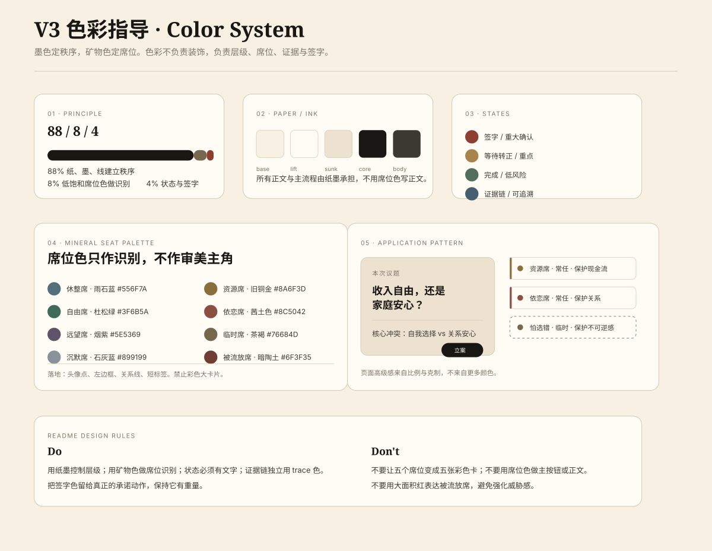

# V3 Color Design Guide

> **Revision Notice (V3 开发前定稿)**：本文部分 token 与比例已被 [`V3-IVY-FINAL-DIRECTION.md`](./V3-IVY-FINAL-DIRECTION.md) 第 2.1 节修订（`paper.base` 去黄、新增 `surface.deep`、比例 78/14/5/3）。冲突时以 IVY-FINAL 为准。下方是基础规范结构。

## Core Rule

> **墨色定秩序，矿物色定席位。**

ParallelMe V3 不使用「五个角色五种大色块」的配色方式。那会让产品看起来像角色卡片或心理测试。

色彩比例（**已被 IVY-FINAL 修订**）：

- **78% 纸 / 墨 / 线**：建立阅读秩序和私密感。
- **14% `paper.lift`**：议案纸 / 主内容
- **5% 低饱和矿物席位色**：只用于识别席位（点 / 边框 / 关系线 / 短标签）。
- **3% 状态色**：只用于签字、完成、等待转正、证据链等语义状态。

V3 加入了 `surface.deep` 深色仪式空间（仅用于裁决 / 签字页），所以 `paper` 类比例从原 88% 下调到 78%+14%。

## Foundation Tokens

| Token | Hex (V3 锁定) | Usage |
|---|---|---|
| `paper.base` | **`#F4F1EC`** ← 修订 | 页面底色（去黄、向 Quiet Luxury 收敛） |
| `paper.lift` | **`#FBF9F4`** ← 修订 | 主纸面、议案纸 |
| `paper.sunk` | `#EDE2D0` | 次级区域、档案层 |
| `paper.edge` | `#D8CBB8` | 细线、纸边 |
| `surface.deep` | **`#1A1816`** ← 新增 | **裁决页 / 签字页深色仪式空间（情绪峰值外化）** |
| `ink.core` | `#191713` | 主文字、主 CTA |
| `ink.body` | `#3C3932` | 正文 |
| `ink.mute` | `#7C7568` | 侧记、meta |
| `ink.faint` | `#B7AC9B` | disabled、低存在信息 |

## Seat Tokens

| Seat | Hex | Usage |
|---|---|---|
| 休整席 | `#556F7A` | 头像点、左边框、关系线 |
| 资源席 | `#8A6F3D` | 头像点、左边框、关系线 |
| 自由席 | `#3F6B5A` | 头像点、左边框、关系线 |
| 依恋席 | `#8C5042` | 头像点、左边框、关系线 |
| 远望席 | `#5E5369` | 头像点、左边框、关系线 |
| 临时席 | `#76684D` | 虚线边框、临时状态 |
| 沉默席 | `#899199` | 低透明度、沉默状态 |
| 被流放席 | `#6F3F35` | 小面积提示，不做大红警告 |

## Functional Tokens

| Token | Hex | Usage |
|---|---|---|
| `seal.action` | `#8E3F32` | 签字、重大确认 |
| `gold.attention` | `#A8844D` | 等待转正、重点提示 |
| `green.safe` | `#536E5A` | 完成、低风险 |
| `blue.trace` | `#455F70` | 证据链、可追溯引用 |

## Do

- 用纸墨控制页面层级。
- 用席位色做点、线、边框和短标签。
- 所有状态都同时写文字，不靠颜色单独表达。
- 主 CTA 用 `ink.core` 或 `seal.action`。
- 签字色只留给真正有承诺重量的动作。

## Don't

- 不要把五个席位做成五张彩色大卡。
- 不要用席位色写正文。
- 不要用席位色做主按钮。
- 不要大面积使用红色表达「被流放席」。
- 不要让页面色彩密度超过内容本身。

