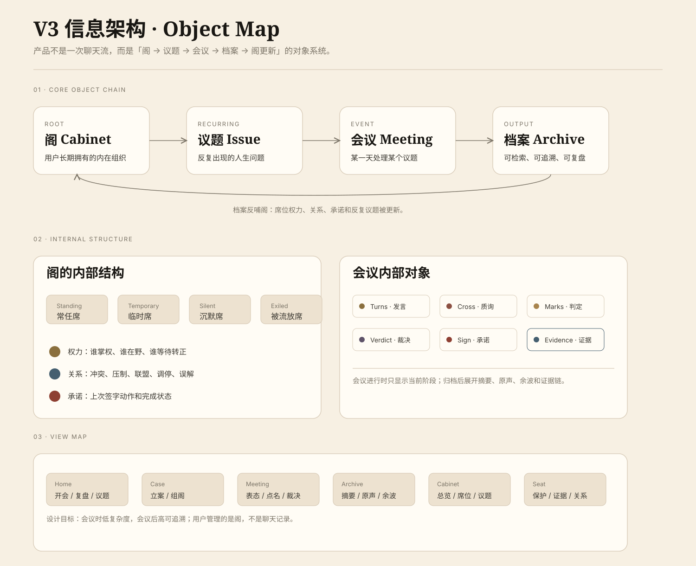

# V3 Information Architecture Guide



> **Revision Notice (V3 开发前定稿)**：本文对象层级已被 [`V3-IVY-FINAL-DIRECTION.md`](./V3-IVY-FINAL-DIRECTION.md) 第 3.2 节修订 —— **席位（Seat）必须是横切的独立对象**，而不是会议的从属。原因：用户在多次议题后点开某席位详情时，应看到它在所有议题中的活动史。冲突时以 IVY-FINAL 为准。

## Core Rule

> ParallelMe 不是一次聊天流，而是「阁 → 议题 / 席位 → 会议 → 档案 → 阁更新」的对象系统。

V3 的信息架构必须让用户感觉自己拥有的是一个长期内在组织，而不是一串 AI 对话记录。

## Object Hierarchy（V3-IVY-FINAL 修订版）

```text
        ┌─────────────────────────────────┐
        │           阁 Cabinet            │  长期组织
        └─────┬─────────────────────┬────┘
              │                     │
        ┌─────▼──────┐        ┌────▼──────┐
        │  议题 Issue│        │ 席位 Seat │  长期对象（横切）
        └─────┬──────┘        └────▲──────┘
              │                    │
        ┌─────▼───────────────────┼┐
        │      会议 Meeting        ││
        │  Turns / Cross / Verdict ││ ← 引用席位
        │  Commitment / Evidence   ││
        └──────────────────────────┘
```

席位是 **横切独立对象**，不是会议的从属。这样席位可以累积自己的活动史、被采纳次数、关系网。

## Memory Consent Gate（V3-IVY-FINAL 新增）

每次会议结束写入档案前，系统必须出现 Memory Consent Gate，列出 ≤3 条候选记忆，让用户：
- 全部记住
- 逐条确认
- 这次不记

这是 V3 信任护城河，详见 `V3-IVY-FINAL-DIRECTION.md` 第 3.3 节。

## Core Objects

| Object | Meaning | UI Surface |
|---|---|---|
| 阁 | 用户长期拥有的内在组织 | 我的阁 |
| 议题 | 反复出现的人生问题 | 反复议题 / 议题详情 |
| 会议 | 某一天处理某个议题 | 会议进行页 |
| 档案 | 一次会议的永久记录 | 会议档案 |
| 证据链 | 支撑摘要和洞察的原始来源 | 原声 / 质询 / 用户判定 |

## Cabinet Structure

「我的阁」不是数据看板，而是私人组织管理页。

它包含：

- 常任席
- 临时席
- 沉默席
- 被流放席
- 席位关系
- 权力变化
- 承诺状态
- 反复议题

## Meeting Structure

会议进行时只显示当前阶段，不暴露完整档案结构。

会议结束后，档案必须展开：

- 摘要
- 原声
- 余波
- 证据链

所有系统生成的侧记、洞察和席位变化都应该能追溯到具体发言、质询或用户判定。

## View Map

| View | Responsibility |
|---|---|
| Home | 今日开会、待复盘、反复议题 |
| Case / Assemble | 立案、组阁、入席理由 |
| Meeting | 表态、点名、质询、裁决 |
| Archive | 摘要、原声、余波、证据 |
| Cabinet | 总览、席位、议题、档案 |
| Seat Detail | 席位记忆、保护功能、关系证据 |

## Design Rules

- 首页不是空白新建页，要同时展示「今日开会」「待复盘」「反复议题」。
- 会议进行页保持低复杂度，一次只处理一个阶段。
- 档案页承担追溯、复盘和证据展示。
- 我的阁承担长期管理，不塞进会议流程。
- 席位变化必须有出处，不能凭空生成结论。

