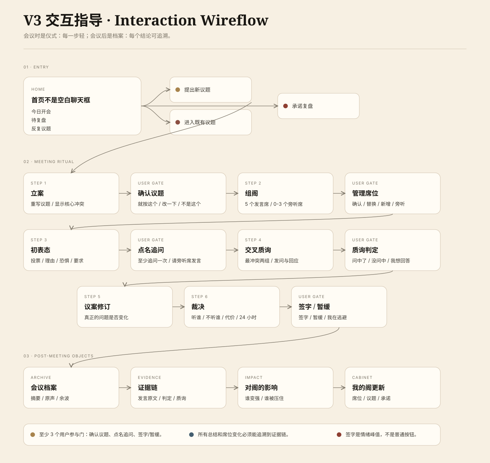

# V3 Interaction Design Guide



> **Revision Notice (V3 开发前定稿)**：本文 "Required User Gates" 已被 [`V3-IVY-FINAL-DIRECTION.md`](./V3-IVY-FINAL-DIRECTION.md) 第 3.3 节修订 —— 必须门从 3 个升到 **4 个**（新增 Memory Consent Gate）。同时新增心理安全 off-ramp 节点。冲突时以 IVY-FINAL 为准。

## Core Rule

> 会议时是仪式，会议后是档案。

V3 的交互不能让用户只是观看 AI 输出。每次会议必须有明确的用户主持动作。

## Three Layers

### 1. Entry

首页不是空白聊天框，而是阁的入口。

首页必须同时包含：

- 今日开会
- 待复盘
- 反复议题

用户可以从三个方向进入：

- 提出新议题
- 进入既有议题
- 复盘上次承诺

### 2. Meeting Ritual

会议过程保持低复杂度，一次只处理一个阶段。

主流程：

```text
立案
→ 确认议题
→ 组阁
→ 管理席位
→ 初表态
→ 点名追问
→ 交叉质询
→ 质询判定
→ 议案修订
→ 裁决
→ 签字 / 暂缓
```

### 3. Post-Meeting Objects

会议结束后，信息进入档案系统。

```text
会议档案
→ 证据链
→ 对阁的影响
→ 我的阁更新
```

这一步让产品从“一次体验”变成“长期系统”。

## Required User Gates（V3-IVY-FINAL 修订：4 道必须门）

每次会议至少有 **4 个** 用户参与门：

1. **确认议题**
   用户确认问题是否被问准。

2. **点名追问**
   用户至少追问一个席位，不能只看五席表演。

3. **签字 / 暂缓 / 我在逃避**
   用户决定是否承担这个 24 小时动作。逃生口必须显式提供。

4. **Memory Consent Gate**（V3-IVY-FINAL 新增 · V3 信任护城河）
   会议结束、写入档案前，用户对系统提议记住的 ≤3 条记忆做：全部记住 / 逐条确认 / 这次不记。

可选参与门：

- 管理席位
- 替换席位
- 请旁听席发言
- 质询判定
- 议案修订

## 心理安全 Off-Ramp（V3-IVY-FINAL 新增）

任何会议过程中，如果用户输入触发危机词（自伤 / 自杀 / 不想活 等），**必须立即暂停会议**，显示安全转向页：

> 它注意到你现在可能很难。
> 它不是诊断工具，也不能替代专业帮助。
> 中国心理援助热线：**010-82951332** / **400-161-9995**
> 你可以随时回来，但现在请先照顾好自己。

详见 `docs/research/V3/05-mental-health-ai-safety.md`。

## Interaction Principles

- 会议进行时不要展开复杂关系图。
- 不要在同一屏同时显示所有发言、证据链和席位权力变化。
- 每个阶段只给一个主动作。
- 用户插话必须能被接住，但系统要回到会议阶段。
- 所有总结、洞察、席位变化都必须能追溯到证据链。
- 签字是情绪峰值，要有仪式感，不能像普通确认按钮。

## Screen Responsibilities

| Screen | Responsibility |
|---|---|
| Home | 今日开会、待复盘、反复议题 |
| Case | 重写议题、显示核心冲突 |
| Assembly | 推荐席位、解释入席理由 |
| Meeting | 表态、点名、质询、裁决 |
| Signature | 签字、暂缓、我在逃避 |
| Archive | 摘要、原声、余波 |
| Evidence | 发言原文、用户判定、质询来源 |
| Cabinet | 席位权力、关系、承诺、反复议题 |

## Success Criteria

用户完成第一次会议后，应该能说：

- 它帮我把问题问准了。
- 它请出来的声音是为我这次议题来的。
- 我不是在看 AI 表演，我参与了主持。
- 最后不是一个答案，而是一份我签过的会议决议。
- 它记住的不是聊天记录，而是我的阁。

