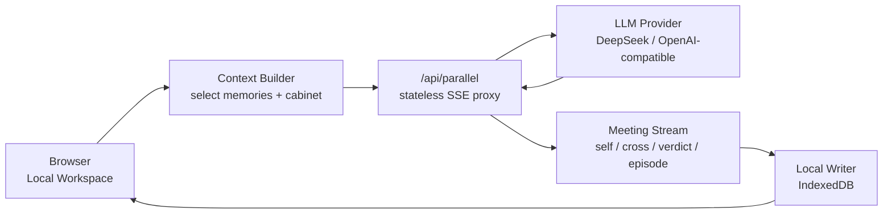

# ParallelMe V3 · Local-First 技术架构

> 本文定义 ParallelMe 从 demo 进入 V3「内在组阁系统」时的技术架构原则。
> 核心目标：先不要账号系统和云数据库，把用户、API Key、记忆、阁、会议档案全部做成本地优先、可导出、可迁移、低门槛的个人工作区。

---

## 0 · 结论先行

V3 的第一版不做登录、不做云同步、不做复杂用户系统。

ParallelMe 应该先采用：

> **本地工作区 + 浏览器私有存储 + 无状态 API Proxy + 可导出的明文档案**

用户身份不是邮箱账号，而是本机上的一个「本地阁」：

```text
ParallelMe Local Workspace
  ├─ provider config    LLM 服务商、base URL、model、key 的本地配置
  ├─ me profile         用户自填画像
  ├─ cabinet            阁、席位、关系、权力变化
  ├─ issues             反复议题
  ├─ meetings           会议档案
  ├─ memories           事件、洞察、承诺、证据链
  └─ exports            可导出的 JSON / Markdown 备份
```

这条路线的好处：

- 用户第一次打开时不被注册登录打断。
- 用户自己的 API Key 只存在自己设备上。
- 服务端不保存用户内容，风险和成本都低。
- 未来要加账号同步时，只是在本地工作区之外加一个可选同步层。
- 产品气质更像「我的阁」而不是「某个平台里的聊天记录」。

---

## 1 · 外部调研结论

我们重点借鉴 CoPaw、OpenClaw、Hermes Agent 这类 agent-native 产品，不是照搬它们的复杂 agent loop，而是抽取三个原则。

### 1.1 本地工作区是产品的根

CoPaw 默认把配置、会话、技能、记忆放在 `~/.copaw`，也允许通过环境变量换工作目录。Hermes 把配置、密钥、记忆、技能、会话和日志收束在 `~/.hermes`。这类产品的关键不是“注册账号”，而是“用户拥有一个可理解、可迁移的个人目录”。

对 ParallelMe 的转译：

- Web MVP 用浏览器 IndexedDB 作为本地工作区。
- 将来桌面版或本地 server 版可以映射到 `~/.parallelme`。
- 用户必须能导出完整工作区，而不是被困在某个 SaaS 数据库里。

### 1.2 明文记忆比神秘向量库更重要

OpenClaw 和 CoPaw 都强调：模型只“记得”写入磁盘的内容；长期记忆应该有 Markdown 文件作为可检查的事实来源。CoPaw 在此基础上再加语义搜索和 BM25 混合检索。Hermes 进一步区分 agent memory 与 user profile，并限制注入容量，避免系统提示无限膨胀。

对 ParallelMe 的转译：

- IndexedDB 是运行时主库。
- Markdown / JSON 导出是用户可读的“档案副本”。
- 记忆必须有证据链，不能只有 LLM 总结。
- 长期注入上下文必须有预算，不把全部历史塞进 prompt。

### 1.3 Setup Wizard 比 Settings Page 更重要

Hermes 的 `hermes setup` 和 `hermes model` 把 provider、API Key、工具启用做成引导流程。CoPaw 也把初始化工作区和模型配置当成第一路径。

对 ParallelMe 的转译：

- 首次进入不是先显示失败的聊天框，而是进入「给你的阁一把钥匙」引导。
- 默认推荐 DeepSeek，同时支持 OpenAI-compatible 自定义端点。
- 先测通模型，再开始第一次会议。
- 没填 key 时仍可进入「演员模式」，但 UI 要明确告诉用户这是体验模式。

---

## 2 · 当前项目现状

项目现在已经有轻量本地化基础：

| 模块 | 当前实现 | V3 问题 |
|---|---|---|
| `lib/profile.ts` | `localStorage` 保存 me profile / taste | 容量小、结构弱、不可检索、不可迁移 |
| `lib/memory.ts` | `localStorage` 保存 episodes / insights | 缺少会议、席位、证据链、承诺对象 |
| `lib/llm.ts` | 服务端从 `.env.local` 读取 provider | 适合开发者自部署，不适合用户自己填 key |
| `app/api/parallel/route.ts` | 无状态 SSE 生成会议流 | 方向正确，V3 继续保持 server stateless |
| `.env.example` | 环境变量配置真实 LLM | 要保留为 self-host 方式，但不能作为普通用户主路径 |

所以 V3 不需要推倒重来。

真正要做的是：

> 把 `localStorage MVP` 升级为 `ParallelMe Local Workspace`，把 `.env.local` 开发者配置升级为用户可完成的 `Provider Setup Wizard`。

---

## 3 · 总体架构

### 3.1 边界原则

```text
Browser owns identity, key config, memory, cabinet.
API route owns orchestration proxy only.
LLM provider owns generation.
ParallelMe server owns no user state in V3.
```

### 3.2 请求链路



### 3.3 服务端约束

V3 的 API route 必须保持无状态：

- 不写数据库。
- 不保存用户输入。
- 不保存用户 API Key。
- 不把 key 打到日志。
- 只做 provider 请求、流式编排和 mock fallback。

这使得账号系统可以延后，而且一旦未来加入同步，也不会污染核心会议链路。

---

## 4 · API Key 首次引导

### 4.1 产品目标

用户第一次启动时，不应该看到“请配置环境变量”。

用户应该被带进一个温和但明确的引导：

> 你的阁需要一把只属于你的模型钥匙。它会存在这台设备上，你随时可以更换或删除。

### 4.2 Setup Wizard 步骤

```text
Step 1 · 选择服务商
  DeepSeek 推荐
  OpenAI
  OpenAI-compatible
  演员模式

Step 2 · 填写连接信息
  API Key
  Base URL
  Model

Step 3 · 测试连接
  发起极小 token 请求
  返回：可用 / 模型名 / 延迟 / 错误原因

Step 4 · 选择保存方式
  仅本浏览器保存
  本次会话临时保存
  自部署环境变量模式

Step 5 · 第一次会议教学
  用一个低风险示例议题完成立案、组阁、点名追问、签字
```

### 4.3 Provider Config 数据结构

```ts
export interface ProviderConfig {
  id: string;
  provider: "deepseek" | "openai" | "openai-compatible" | "mock";
  label: string;
  baseUrl: string;
  model: string;
  apiKeyRef: "browser" | "session" | "env";
  maskedKey?: string;
  createdAt: number;
  lastTestedAt?: number;
  lastStatus?: "ok" | "failed";
}
```

API Key 本体不进入普通对象日志。浏览器端可以单独存：

```ts
export interface ProviderSecret {
  providerConfigId: string;
  encrypted?: boolean;
  apiKey: string;
  updatedAt: number;
}
```

### 4.4 存储策略

| 模式 | 适合用户 | 存储位置 | 说明 |
|---|---|---|---|
| Browser only | 普通用户 | IndexedDB / localStorage fallback | 默认路径，简单可用 |
| Session only | 临时体验 | `sessionStorage` / React state | 关闭窗口即失效 |
| Env mode | 开发者自部署 | `.env.local` | 当前项目已经支持 |
| Actor mode | 没有 key 的用户 | 不存 key | mock 体验，帮助理解产品 |

后续如果要更严谨，可以加入 WebCrypto + 本地口令加密。但第一版不要让加密口令阻断用户启动。

### 4.5 API Route 调整

当前 `lib/llm.ts` 只读取环境变量。V3 应改为双来源：

```text
优先：request provider config + browser key
其次：server env provider
最后：mock actor mode
```

推荐改造方向：

```ts
export interface LlmRuntimeConfig {
  apiKey?: string;
  baseUrl: string;
  model: string;
  source: "request" | "env" | "mock";
}
```

`/api/parallel` 接收：

```ts
{
  input: string;
  context: ContextBundle;
  provider?: {
    baseUrl: string;
    model: string;
    apiKey: string;
  };
}
```

注意：如果是公开 hosted 版本，用户的 key 会经过我们的 API proxy。UI 必须说明“密钥会被发送到当前应用服务器用于转发请求，但服务器不保存”。更理想的商业化版本是桌面版或本地 server 版，让 key 不离开设备。

---

## 5 · 本地记忆架构

### 5.1 存储选型

V3 Web MVP 推荐：

| 层级 | 技术 | 原因 |
|---|---|---|
| Runtime DB | IndexedDB | 容量更大、结构化、适合会议档案 |
| Fallback | localStorage | 兼容当前实现和极简场景 |
| Export | JSON + Markdown | 用户可迁移、可读、可备份 |
| Search V1 | 本地关键词 / Fuse.js | 不依赖 embedding key |
| Search V2 | 可选 embedding + local vector store | 等档案规模变大再做 |

第一版不要直接上云数据库或向量库。记忆的真正难点不是数据库，而是“什么值得记、如何证明、何时注入”。

### 5.2 记忆分层

```text
L0 · Session Working
  当前会议上下文，会议结束后写入档案

L1 · Meeting Archive
  一次会议的完整结构：议题、席位、发言、质询、用户判定、裁决

L2 · Episodic Memory
  高重要度事件卡：用户面对了什么、哪个席位掌权、做了什么承诺

L3 · Reflective Memory
  跨会议洞察：反复模式、席位权力变化、长期回避主题

L4 · Cabinet Memory
  每个席位自己的历史、关系、保护功能、被采纳/被压住记录
```

### 5.3 核心数据对象

```ts
export interface LocalWorkspace {
  id: string;
  schemaVersion: number;
  createdAt: number;
  updatedAt: number;
  locale: "zh-CN" | "en-US";
}

export interface Cabinet {
  id: string;
  ownerWorkspaceId: string;
  name: string;
  standingSeatIds: string[];
  temporarySeatIds: string[];
  silentSeatIds: string[];
  exiledSeatIds: string[];
  updatedAt: number;
}

export interface Seat {
  id: string;
  name: string;
  type: "standing" | "temporary" | "silent" | "exiled";
  psychologicalFunction: string;
  protects: string;
  fears: string;
  voiceStyle: string;
  invitationReason?: string;
  powerScore: number;
  relationIds: string[];
  memoryIds: string[];
  createdFromIssueId?: string;
  updatedAt: number;
}

export interface Issue {
  id: string;
  title: string;
  rawInput: string;
  refinedQuestion: string;
  status: "open" | "resolved" | "recurring" | "archived";
  themeTags: string[];
  activatedModeTags: string[];
  meetingIds: string[];
  createdAt: number;
  updatedAt: number;
}

export interface Meeting {
  id: string;
  issueId: string;
  title: string;
  stage: "draft" | "assembled" | "in_meeting" | "verdict" | "signed" | "paused";
  seatIds: string[];
  turnIds: string[];
  crossExamIds: string[];
  userMarkIds: string[];
  verdictId?: string;
  commitmentId?: string;
  createdAt: number;
  closedAt?: number;
}

export interface Evidence {
  id: string;
  sourceType: "turn" | "cross_exam" | "user_mark" | "verdict" | "commitment";
  sourceId: string;
  quote: string;
  meetingId: string;
  seatId?: string;
}

export interface MemoryInsight {
  id: string;
  statement: string;
  confidence: number;
  evidenceIds: string[];
  appliesTo: "workspace" | "cabinet" | "seat" | "issue";
  targetId: string;
  supersededBy?: string;
  createdAt: number;
}
```

### 5.4 证据链规则

所有长期洞察必须满足：

```text
洞察 statement
  └─ evidenceIds
       ├─ 原始席位发言
       ├─ 用户点名追问
       ├─ 用户质询判定
       └─ 裁决 / 签字
```

禁止无证据写入：

- “你总是害怕失败。”
- “你是讨好型人格。”
- “出走的我已经变强。”

允许有证据写入：

- “过去 3 次职业议题里，用户都把「稳定」标记为有道理，但最后签字动作都偏向「拖延观察」。”
- “在 2026-05-04 的会议中，用户点名追问了「怕让人失望的我」，并把它标为‘说中了但不想听’。”

---

## 6 · 上下文注入策略

### 6.1 不把全部记忆塞进 prompt

每次会议只构建一个 `ContextBundle`：

```ts
export interface ContextBundleV3 {
  meCard?: string;
  tasteProfile?: string;
  cabinetBrief?: string;
  activeIssueBrief?: string;
  relevantSeatMemories?: string[];
  recentCommitments?: string[];
  recurringPatterns?: string[];
}
```

### 6.2 注入预算

| 内容 | 预算 | 规则 |
|---|---:|---|
| meCard | 800 chars | 用户稳定画像 |
| cabinetBrief | 1200 chars | 当前阁的席位摘要 |
| activeIssueBrief | 800 chars | 当前议题历史 |
| relevantSeatMemories | 1500 chars | 只取本次入席席位相关记忆 |
| recentCommitments | 600 chars | 最近未复盘承诺 |
| recurringPatterns | 800 chars | 高置信跨会话洞察 |

V3 第一版保持 5K 中文字符以内，避免上下文越来越重。

### 6.3 召回规则

```text
输入议题
  → 识别 theme tags + activated modes
  → 找相似 issue
  → 找相关 seats
  → 找未复盘 commitments
  → 组装 ContextBundle
  → 发起会议
```

第一版可以先用关键词和标签匹配。等用户档案超过一定规模，再加入 embedding 检索。

---

## 7 · 账号系统路线

### 7.1 为什么现在不做账号

账号系统会立刻引入：

- 登录注册 UI。
- 密码 / OAuth。
- 云数据库。
- 隐私协议。
- 数据删除合规。
- key 托管风险。
- 多端同步冲突。

这些会把产品从“开会”拖向“配置平台”。

V3 的战略应该是：

> 不要让用户为了认识自己，先注册一个 SaaS。

### 7.2 分阶段路线

| 阶段 | 用户身份 | 数据位置 | 目标 |
|---|---|---|---|
| Phase 0 | 无身份 | 当前 `localStorage` | demo 已实现 |
| Phase 1 | 本地 workspace id | IndexedDB | 可长期使用 |
| Phase 2 | 导入 / 导出身份 | JSON + Markdown backup | 可迁移、可备份 |
| Phase 3 | 本地口令加密 | WebCrypto | 提升安全感 |
| Phase 4 | 可选账号同步 | Supabase / Postgres / S3 | 多端同步，不作为默认路径 |

即使未来有账号，也应该是：

> “同步我的阁”功能，而不是“登录后才能使用”。

---

## 8 · 导出格式

### 8.1 JSON 备份

文件名：

```text
parallelme-backup-YYYY-MM-DD.json
```

内容：

```json
{
  "schemaVersion": 3,
  "exportedAt": 1777900000000,
  "workspace": {},
  "profile": {},
  "cabinet": {},
  "seats": [],
  "issues": [],
  "meetings": [],
  "turns": [],
  "memories": [],
  "commitments": [],
  "insights": []
}
```

不导出 API Key，除非用户显式选择并二次确认。

### 8.2 Markdown 档案

导出目录：

```text
parallelme-export/
  ├─ README.md
  ├─ me.md
  ├─ cabinet.md
  ├─ issues/
  │   └─ 2026-05-04-career-choice.md
  ├─ meetings/
  │   └─ 2026-05-04-001.md
  ├─ seats/
  │   └─ afraid-to-disappoint.md
  └─ insights.md
```

Markdown 是人读的，JSON 是机器恢复的。

---

## 9 · 安全与隐私规则

### 9.1 API Key

- UI 永远只显示 masked key。
- API key 不进入 meeting archive。
- API key 不进入 export。
- API route 不打印 Authorization header。
- 连接测试使用最小 token。
- 用户可一键删除 key。
- `.env.local` 只作为开发者自部署路径。

### 9.2 会议内容

- V3 默认不上传到任何数据库。
- 用户必须能“忘掉我”。
- 用户必须能删除单次会议、单个席位记忆、全部本地数据。
- 洞察必须可追溯、可撤销。

### 9.3 心理安全

- 不做诊断。
- 不输出治疗替代声明以外的医疗建议。
- 不鼓励用户把高风险行为交给模型裁决。
- 高风险输入进入安全回应，而不是组阁表演。

---

## 10 · 实施计划

### Phase A · Provider Setup Wizard

目标：用户不用改 `.env.local` 也能填 key 启动真实 LLM。

改动：

- 新增 `lib/provider.ts`
- 新增本地 provider config 存储
- 新增 `/api/provider/test`
- 改造 `lib/llm.ts` 支持 request runtime config
- 首页增加首次引导状态

验收：

- DeepSeek 用户可以在 UI 填 key、测通、开始会议。
- 没 key 时可以明确进入演员模式。
- `.env.local` 仍然可用于开发者自部署。

### Phase B · IndexedDB Local Workspace

目标：替换 `localStorage` 作为主记忆层。

改动：

- 新增 `lib/local-db.ts`
- 建立 schema version / migration
- profile / taste / episodes / insights 迁移到 IndexedDB
- 保留 localStorage fallback

验收：

- 旧 demo 数据可迁移。
- 用户可以清空本地阁。
- 浏览器刷新后档案稳定存在。

### Phase C · Cabinet / Issue / Meeting 对象化

目标：从“聊天记录”升级为“会议档案系统”。

改动：

- 新增 cabinet / seat / issue / meeting / evidence 类型
- 会议结束写入结构化档案
- 首页显示待复盘、反复议题、最近会议
- 我的阁显示席位状态

验收：

- 每次会议都有 issue、meeting、turn、verdict、commitment。
- 洞察和席位变化可以追溯到 evidence。

### Phase D · Export / Import

目标：用户真正拥有自己的阁。

改动：

- 导出 JSON backup
- 导出 Markdown archive
- 导入 JSON backup
- 版本兼容校验

验收：

- 新浏览器可以通过导入恢复完整本地阁。
- API Key 默认不导出。

---

## 11 · 产品交互要求

技术架构必须服务于一个简单体验：

```text
第一次打开
  → 选择模型服务商
  → 粘贴 API Key
  → 测试连接
  → 开始第一次会议
  → 系统写入本地阁
  → 第二次回来引用具体记忆
```

用户不应该理解：

- 什么是环境变量。
- 什么是 serverless。
- 什么是数据库。
- 什么是向量检索。

用户只需要知道：

- 我的钥匙在哪里。
- 我的阁在哪里。
- 它记住了什么。
- 我能不能删掉。
- 我能不能带走。

---

## 12 · 架构原则

1. **Local first, cloud optional**  
   本地可完整使用，云同步以后再作为增强。

2. **Workspace before account**  
   先有本地阁，再有账号同步。

3. **Inspectable memory**  
   记忆必须能看、能改、能删、能导出。

4. **Evidence before insight**  
   长期洞察必须有证据链。

5. **Stateless server**  
   API route 只做编排和转发，不成为用户数据中心。

6. **Setup is product**  
   API Key 引导不是设置页边角料，而是第一次信任建立。

7. **Actor mode stays**  
   没 key 也能体验，但必须清楚标注是真实模型还是演员模式。

---

## 13 · 参考来源

- CoPaw Docs: Config & Working Directory, Memory & Compaction  
  https://copaw.bot/docs/config.html  
  https://copaw.bot/docs/memory.html
- OpenClaw Docs: Memory Overview  
  https://docs.openclaw.ai/concepts/memory
- Hermes Agent Docs: Configuration, Persistent Memory  
  https://hermes-agent.nousresearch.com/docs/user-guide/configuration  
  https://hermes-agent.nousresearch.com/docs/user-guide/features/memory
