# ParallelMe V3 · 技术方向（Tech Direction · ADR）

> 这份文档定义 V3 的工程实现方向。
> 命题：**V3 比 V2 更轻便，技术服务于产品设计。**
> 它不替代 `V3-LOCAL-FIRST-TECH-ARCH.md`（本地优先架构），而是站在它之上回答更上层的问题：依赖、orchestration、prompt caching、design system 落地、SSE 升级、演员模式契约、部署。

---

## 0 · 总命题

V3 的工程目标只有两个：

1. **减少代码量、减少依赖、减少抽象**。能用 React 18 + Next.js 14 + 原生 fetch + IndexedDB 解决的，不引入大框架。
2. **每一行代码都必须服务于 V3-IVY-FINAL-DIRECTION 中的某条产品决策**。技术决策不为"工程优雅"，只为"产品形态稳定地落到屏幕上"。

V3 的"轻便"不是指代码少，而是指**复杂度可被一个人在一个下午看懂**。

---

## 1 · V2 现状盘点

### 1.1 依赖

```json
{
  "dependencies": {
    "next": "14.2.15",
    "react": "18.3.1",
    "react-dom": "18.3.1"
  },
  "devDependencies": {
    "@types/*", "autoprefixer", "postcss",
    "tailwindcss": "3.4.4",
    "typescript": "5.4.5"
  }
}
```

V2 已经做到极致简：**0 个 runtime 第三方包**。这是 V3 的起点也是边界。

### 1.2 代码

```
app/
├── page.tsx                 主入口 SSE 客户端
├── about/                   关于
├── me/                      底片 / 纸页 / 底色 / 洞见
└── api/
    ├── parallel/            ★ 核心 SSE：5 路并行 + cross + NowMe + critic
    ├── taste/               14 字判词
    ├── followup/            上次承诺
    ├── share/               分享纸页
    └── agent/               A2A 元数据

lib/
├── selves.ts (232 行)       IFS 双层 persona card
├── llm.ts (575 行)          GAN harness + 动态 pair + meta-critic
├── profile.ts               me.md + taste 数据契约 + localStorage
└── memory.ts                L1/L2/L3 三层记忆原语
```

V3 不推翻这个结构，而是**沿着对象系统的需要扩展**。

### 1.3 V2 → V3 的差异

| 维度 | V2 | V3 |
|---|---|---|
| 角色 | 5 个固定分身 | 阁的席位（常任 / 临时 / 旁听 / 沉默 / 流放） |
| 数据 | localStorage（episodes / insights） | IndexedDB Local Workspace（cabinet / issues / meetings / seats / evidence） |
| LLM 入口 | `.env.local` 服务端读取 | Provider Setup Wizard + 双来源（request / env / mock） |
| 流式 | 单次 SSE：5 路并行 + cross + verdict | 状态机 SSE：会议有阶段，每阶段单独流 |
| 上下文 | `meCard + tasteProfile + recentEpisode` | `ContextBundleV3`（含 cabinetBrief / activeIssueBrief / relevantSeatMemories） |
| Persona prompt | 硬编码 in `selves.ts` | 仍硬编码 + 用户可命名/转正/合并的席位状态 |

**关键决策**：persona 的核心定义（保护对象、恐惧、口头禅）保留 hardcoded，**不要做"用户自由捏 part"** —— 那会变成 Character.ai。V3 的临时席由 LLM 从议题中"显影"出来，但模板必须是受限的。

---

## 2 · V3 八条技术原则

```
1. Local first, cloud optional         (与 V3-LOCAL-FIRST-TECH-ARCH 一致)
2. Workspace before account             (无登录可完整使用)
3. Inspectable memory                   (记忆可见 / 可改 / 可删 / 可导出)
4. Evidence before insight              (洞察必须有证据链)
5. Stateless server                     (API route 只编排 + 转发)
6. Setup is product                     (Provider 引导是首次信任建立)
7. Actor mode stays                     (无 key 也可体验，但显式标注)
8. Token-driven, no inline styles       (一切色彩 / 字体 / 间距 / 动效 / 圆角走 token)
```

第 1-7 条沿用 V3-LOCAL-FIRST-TECH-ARCH。第 8 条是本文新增。

---

## 3 · 总体架构

### 3.1 分层

```text
┌─────────────────────────────────────────────────────────┐
│  Browser (Fat Client)                                    │
│  ┌─────────────────────────────────────────────────┐    │
│  │  UI Layer · React + Tokens                       │    │
│  │  ────────────────────────────────────────────    │    │
│  │  Local Workspace · Dexie / IndexedDB             │    │
│  │  ────────────────────────────────────────────    │    │
│  │  Context Builder · select memories + cabinet     │    │
│  └────────────────────────┬────────────────────────┘    │
└──────────────────────────────│───────────────────────────┘
                               │
                               ▼
                      /api/parallel (SSE)
                      /api/provider/test
                      ─────────────────────
                      Stateless edge handler
                      No DB · No user state
                               │
                               ▼
                      LLM Provider
                  (DeepSeek / OpenAI-compatible
                   /  自部署 Ollama)
```

**核心规则**：

- 服务端永远不写数据库
- 服务端永远不保留用户输入
- 服务端永远不保留 API Key
- 服务端的存在感越低，V3 越成功

### 3.2 数据流

```mermaid
flowchart LR
  A[User Input] --> B[Local Workspace<br/>read cabinet + me.md + recent]
  B --> C[Context Builder<br/>budget cap]
  C --> D[/api/parallel SSE/]
  D --> E[Stage 1<br/>立案]
  E --> F[Stage 2<br/>组阁]
  F --> G[Stage 3<br/>表态 5 并行]
  G --> H[Stage 4<br/>动态 pair 质询]
  H --> I[Stage 5<br/>NowMe + Critic 收束]
  I --> J[Stage 6<br/>Verdict + Commitment]
  J --> K[Local Writer<br/>Dexie tx]
  K --> L[Memory Consent Gate]
  L --> M[Cabinet Update]
```



---

## 4 · LLM Provider 抽象层

### 4.1 设计目标

V3 必须同时支持：
- 用户在浏览器粘贴 key（最常见路径）
- 自部署用户用环境变量（开发者）
- 没 key 用户用演员模式（体验）

### 4.2 Runtime Config 类型

```ts
export interface LlmRuntimeConfig {
  source: "request" | "env" | "mock";
  baseUrl: string;
  model: string;
  apiKey?: string;            // mock 模式下可空
  capabilities: {
    streaming: boolean;
    promptCaching: boolean;   // Anthropic 才有
    jsonMode: boolean;
  };
}
```

### 4.3 解析顺序

```text
优先：request body 中带 provider config + apiKey
其次：服务端 .env 提供的全局 provider
最后：mock actor mode
```

### 4.4 改造 `lib/llm.ts`

V2 当前从 `process.env` 读，V3 改为接受运行时 config：

```ts
// 旧
const API_KEY = process.env.OPENAI_API_KEY || "";

// 新
export async function chat(
  messages: Msg[],
  config: LlmRuntimeConfig,
  opts?: { temperature?: number; max_tokens?: number; json?: boolean }
): Promise<string>
```

调用方（API route）负责把 request body 中的 provider 信息或环境变量解析为 `LlmRuntimeConfig`。

### 4.5 安全规则

- API Key 永远不进 console.log / error reporting
- API Key 永远不进 SSE event
- API Key 永远不进 export
- UI 永远只显示 `sk-***...***xx` masked 形态

详见 `V3-LOCAL-FIRST-TECH-ARCH.md` 第 9 节。

---

## 5 · 多 Agent Orchestration 选型

### 5.1 三个候选

| 方案 | 优 | 劣 |
|---|---|---|
| **A. 自写编排（保留 V2 路线）** | 0 依赖、对 SSE 完全可控、当前已可工作 | persona 状态机、动态组阁、阶段切换都要自己撸；prompt caching 要手撸 |
| **B. Vercel AI SDK 5/6** | Agent abstraction、prepareStep / stopWhen、streaming primitives 极成熟、Next.js 原生、prompt caching 一行启用 | +60KB、抽象比当前手写多一层、RSC 路线 paused |
| **C. Anthropic Agent SDK (TS)** | 与 Claude Code 同构、sub-agent / MCP 一流 | 强绑定 Anthropic（与 V3 多 provider 矛盾）、超出 ParallelMe 复杂度需求 |

### 5.2 决策

**主路径：A（自写编排，保留 V2 风格）**
**辅路径：B 的局部能力（Vercel AI SDK 的 `streamText` + `prepareStep`），仅在阶段切换处使用**

理由：
- ParallelMe 的"会议状态机"是产品独特性，不应该被通用 agent loop 抽象掉
- V2 的 SSE 已经可工作，全量切到 SDK 5 是 60KB 包体 + 多一层 typed message 改造，性价比低
- Vercel AI SDK 的 `streamText` 在阶段内部（如 5 路并行表态、动态 pair 质询）值得用，但**不让它接管整个会议**

具体怎么用：
- **会议主链路**：保留自写 SSE
- **每阶段内部并行**：可用 `streamText` 简化 token 流和 abort 控制
- **prompt caching**：直接调用 Anthropic API（如果未来切到 Anthropic）或继续用 OpenAI-compatible（无 caching）

详见 `docs/research/V3/11-tech-stack-references.md`。

---

## 6 · Prompt Caching 策略

### 6.1 命中场景

ParallelMe 的稳定 prefix 大量存在：

| 内容 | 字符数 | 频率 | TTL 选择 |
|---|---:|---|---|
| 5 个常任席的 system prompt（含 IFS 双层 persona） | ~6000 字符 | 每次会议都用 | 5min（自动刷新） |
| 临时席模板池 | ~3000 字符 | 高频 | 5min |
| Cabinet brief（用户自己的阁状态） | ~1500 字符 | 单用户每会议都用 | 1h（用户回访间隔可能 >5min） |
| 工具定义 / JSON schema | ~800 字符 | 全会议 | 5min |

### 6.2 实施

**条件**：仅在 provider 是 Anthropic 时启用（DeepSeek / OpenAI 暂无对等机制）。

**结构**：

```ts
// 静态 prefix（可缓存）
[
  systemPrompt,        // ← cache_control: { type: "ephemeral", ttl: "5m" }
  cabinetBrief,        // ← cache_control: { type: "ephemeral", ttl: "1h" }
  // 动态部分（不缓存）
  recentMessages,
  userInput,
]
```

**预期收益**（[Anthropic 官方文档](https://docs.anthropic.com/en/docs/build-with-claude/prompt-caching)）：
- 缓存读：base price × 0.1（90% 折扣）
- 缓存写：base price × 1.25（5min）/ × 2（1h）
- 长 prompt 延迟降低 ~85%

**ParallelMe 的实际省钱预估**：单次完整内阁会议从 ~30K input tokens → ~8K（cache hit）+ ~5K（cache write 摊销），成本 -60%。

详见 `docs/research/V3/11-tech-stack-references.md` 的 prompt caching 子章节。

### 6.3 注意

- DeepSeek 当前不支持 cache_control，但 ParallelMe 的 OpenAI-compatible 抽象层应**预留 caching 字段**，未来无缝启用
- 会议进行中的临时席、用户输入、点名追问全部是动态的，**不要尝试缓存它们**
- 5min TTL 是默认。用户回访间隔通常 >5min 但 <1h，所以 cabinetBrief 用 1h TTL

---

## 7 · 本地工作区数据层（Dexie 选型）

### 7.1 选型对比

| 库 | 体积（gzip） | 特性 | 决策 |
|---|---:|---|---|
| `localStorage` | 0 | 同步、5MB 上限、无索引、无类型 | V2 用，V3 仅 fallback |
| `idb-keyval` | 1.1KB | 极简、Promise async | 太弱，不能查询 |
| **`Dexie.js`** | **14KB** | **IndexedDB wrapper、声明式 schema、live queries、TS 一流** | **V3 主选** |
| `RxDB` | 62KB | 反应式、内置同步、CRDT | 过度，60KB 包体过大 |
| WASM SQLite | ~1MB | 全 SQL、强一致 | 完全过度 |

**理由**（[BSWEN · Dexie vs idb vs RxDB 2026](https://docs.bswen.com/blog/2026-04-07-indexeddb-libraries-dexie-idb-rxdb/)）：
> "For most web applications, start with Dexie. Its query capabilities and React integration provide immediate value."

ParallelMe 的需求恰好是 Dexie 的甜点：
- 单用户、单设备
- 数百到数千条 meetings / turns / evidences
- 需要按 issue / seat / date 查询
- 需要 live queries 驱动 UI（用 `useLiveQuery` 钩子）
- 不需要同步 / 多用户 / CRDT

### 7.2 数据库 Schema

参考 `V3-LOCAL-FIRST-TECH-ARCH.md` 第 5.3 节定义的对象，落到 Dexie：

```ts
import Dexie, { Table } from "dexie";

export class ParallelMeDB extends Dexie {
  workspaces!: Table<LocalWorkspace, string>;
  cabinets!:   Table<Cabinet, string>;
  seats!:      Table<Seat, string>;
  issues!:     Table<Issue, string>;
  meetings!:   Table<Meeting, string>;
  turns!:      Table<Turn, string>;
  crossExams!: Table<CrossExam, string>;
  userMarks!:  Table<UserMark, string>;
  verdicts!:   Table<Verdict, string>;
  commitments!:Table<Commitment, string>;
  evidences!:  Table<Evidence, string>;
  insights!:   Table<MemoryInsight, string>;

  constructor() {
    super("ParallelMe");
    this.version(3).stores({
      workspaces:  "id, updatedAt",
      cabinets:    "id, ownerWorkspaceId",
      seats:       "id, type, *issueIds, updatedAt",
      issues:      "id, status, createdAt, *themeTags",
      meetings:    "id, issueId, stage, createdAt, closedAt",
      turns:       "id, meetingId, seatId, createdAt",
      crossExams:  "id, meetingId, fromSeatId, toSeatId",
      userMarks:   "id, meetingId, *targetIds, kind",
      verdicts:    "id, meetingId",
      commitments: "id, meetingId, dueAt, status",
      evidences:   "id, meetingId, sourceType, sourceId, seatId",
      insights:    "id, appliesTo, targetId, createdAt",
    });
  }
}

export const db = new ParallelMeDB();
```

### 7.3 迁移策略

V2 → V3 数据迁移：

```text
Step 1 · 启动时检测 localStorage 中的 V2 keys
Step 2 · 一次性迁移到 IndexedDB（保留 localStorage 备份 30 天）
Step 3 · 写迁移日志到 workspaces.metadata.migrations
Step 4 · 30 天后清理 localStorage 备份
```

### 7.4 React 集成

```ts
import { useLiveQuery } from "dexie-react-hooks";

const recentMeetings = useLiveQuery(
  () => db.meetings.orderBy("createdAt").reverse().limit(5).toArray()
);
```

`useLiveQuery` 自动订阅写入事件，UI 自动更新。

### 7.5 导出 / 导入

JSON backup 与 Markdown archive 的格式参考 `V3-LOCAL-FIRST-TECH-ARCH.md` 第 8 节。Dexie 提供 `db.export()`（[dexie-export-import](https://github.com/dexie/Dexie.js/tree/master/addons/dexie-export-import)）一键导出。

---

## 8 · Design System 目录结构

### 8.1 三层 token 架构

参考 [Tyler McDaniel · Building a Design Token System That Scales (2026)](https://www.tostupidtooquit.com/blog/building-design-token-system) 与 [Bootspring · Design Tokens Guide](https://www.bootspring.com/blog/design-tokens-system-guide)：

```
Tier 1 · Primitive  (raw values: hex, px)
   ↓
Tier 2 · Semantic   (paper.base, ink.body, seal.action)
   ↓
Tier 3 · Component  (button-cta-bg, signature-bg)
```

ParallelMe V3 用**两层即可**（primitive + semantic），不引入第三层 component token。理由：第三层是"多团队消费 token"才需要，ParallelMe 是单 codebase。

### 8.2 目录

```
lib/design/
├── tokens/
│   ├── primitive.ts    raw values
│   ├── colors.ts       paper.* / ink.* / seat.* / seal.* / surface.*
│   ├── typography.ts   font stacks + type scale
│   ├── spacing.ts      4 / 8 / 12 / 16 / 24 / 32 / 48
│   ├── radius.ts       0 / 2 / 4 / 8 / 12
│   ├── motion.ts       spring presets / duration tokens
│   └── index.ts        export everything
├── theme/
│   ├── light.css       CSS variables
│   └── deep.css        surface.deep 模式（裁决 / 签字页）
└── components/
    ├── DocketPaper.tsx
    ├── SeatNameplate.tsx
    ├── StageRail.tsx
    ├── SignatureSlip.tsx
    └── Marginalia.tsx
```

### 8.3 Tailwind v4 集成

V3 用 Tailwind v4 CSS-first `@theme`：

```css
/* app/globals.css */
@import "tailwindcss";

@theme {
  --color-paper-base: #F4F1EC;
  --color-paper-lift: #FBF9F4;
  --color-paper-sunk: #EDE2D0;
  --color-surface-deep: #1A1816;

  --color-ink-core: #191713;
  --color-ink-body: #3C3932;
  --color-ink-mute: #7C7568;
  --color-ink-faint: #B7AC9B;

  --color-seat-rest:    #556F7A;
  --color-seat-money:   #8A6F3D;
  --color-seat-roam:    #3F6B5A;
  --color-seat-filial:  #8C5042;
  --color-seat-future:  #5E5369;

  --color-seal-action:  #8E3F32;
  --color-attention:    #A8844D;
  --color-trace:        #455F70;

  --font-sans: "Geist", "PingFang SC", "Noto Sans SC", system-ui, sans-serif;
  --font-serif: "Source Han Serif SC", "Noto Serif SC", "Songti SC", ui-serif, serif;
  --font-mono: "Geist Mono", "IBM Plex Mono", ui-monospace, monospace;

  --radius-sm: 2px;
  --radius-md: 4px;
  --radius-lg: 8px;
  --radius-xl: 12px;
}
```

不再用 `tailwind.config.js`（v4 已废）。一切配置在 CSS 一处。

### 8.4 红线

- 任何组件 / 页面**不允许写 hex / rgb / hsl 字面量** —— 全部走 token
- 任何 `font-family` 字符串**不允许出现在组件中** —— 全部走 token
- 间距 / 圆角 / 阴影同上
- ESLint 规则：禁止 hex 字面量（仅在 `lib/design/tokens/*.ts` 例外）

---

## 9 · SSE 编排升级

### 9.1 V2 SSE 现状

```
data: {"type":"self","id":"lay","name":"躺平的我",...}
data: {"type":"cross","fromId":"money","toId":"lay","text":"..."}
data: {"type":"loudest","id":"filial",...}
data: {"type":"now","text":"..."}
data: {"type":"insight","text":"..."}
data: {"type":"episode","ep":{...}}
data: {"type":"done"}
```

V2 把整个会议作为一条 SSE 流。

### 9.2 V3 SSE 升级：状态机化

V3 将会议拆成有状态的阶段流。每阶段有自己的 SSE，**用户必须在每阶段完成参与门后才进入下一阶段**。

```
POST /api/parallel/case-file        立案    (server: refine question)
                                            ↓ 用户确认
POST /api/parallel/assemble         组阁    (server: pick seats + reasons)
                                            ↓ 用户确认 / 替换
POST /api/parallel/opening          初表态  (server: 5 并行 SSE)
                                            ↓ 用户至少点名一次
POST /api/parallel/cross-exam       质询    (server: dynamic pair SSE)
                                            ↓ 用户判定
POST /api/parallel/revise           议案修订(server: optional)
                                            ↓
POST /api/parallel/verdict          裁决    (server: NowMe + Critic SSE)
                                            ↓ 用户签字 / 暂缓
POST /api/parallel/archive          归档    (server: extract memories)
                                            ↓ Memory Consent Gate
[Local] db.transaction              落库
```

**好处**：
- 每阶段独立可测试、可重试
- 用户的"主持感"被工程结构强制
- 服务端永远 stateless：每个阶段请求自带前序产物

**风险**：网络往返多。
**解法**：会议页保持单 SPA，阶段切换不刷新；客户端持有完整 meeting state；每阶段请求只传 delta（不传整段历史）。

### 9.3 abort 控制

每阶段 SSE 必须可被用户中断（点击"暂停 / 我想说话"）。用 `AbortController` 在客户端管理；服务端检测到 disconnect 立即 abort upstream LLM 请求。

---

## 10 · 演员模式契约

### 10.1 目的

无 API key 用户也能完整体验 V3 全流程。这是 V3 给评委、demo、宣发、用户首次评估的关键体验。

### 10.2 契约

演员模式必须输出**与真实 LLM 完全相同 schema 的 SSE 事件**，仅文本是 mock。

```ts
// lib/llm.ts
function isActorMode(config: LlmRuntimeConfig): boolean {
  return config.source === "mock";
}

if (isActorMode(config)) {
  // 走 mockSelf / mockCross / mockVerdict
  // 但 SSE event type / id / structure 与真实模式完全一致
}
```

### 10.3 UI 标识

演员模式时，UI 顶部必须显示：

```
🎭 演员模式 · 这些声音是预设剧本 · 配置 API Key 解锁真实模型
```

---

## 11 · 部署

### 11.1 Vercel Fluid Compute

V3 SSE 流可能持续 30s-90s。Vercel Fluid Compute（[Vercel 知识库](https://examples.vercel.com/guides/ai-agents)）适合：
- ephemeral process
- streaming SSE
- 多步骤 agent 协调
- 不被传统 serverless 30s timeout 限制

启用方式：项目设置勾选 Fluid Compute（已默认开启对新项目）。

### 11.2 Edge Runtime vs Node Runtime

| Route | Runtime | 原因 |
|---|---|---|
| `/api/parallel/*` | Node | 长 SSE、需要 Anthropic SDK / Vercel AI SDK 完整能力 |
| `/api/provider/test` | Edge | 极轻、低延迟连接测试 |
| `/api/agent` | Edge | A2A 元数据，纯 JSON |

### 11.3 环境变量

```text
OPENAI_BASE_URL          自部署默认 provider URL
OPENAI_API_KEY           自部署默认 key
OPENAI_MODEL             默认 model

# 可选
ANTHROPIC_API_KEY        启用 prompt caching 的 provider
```

服务端环境变量**不**作为普通用户主路径。普通用户走 Provider Setup Wizard 在浏览器填 key。

### 11.4 不做的事

- 不引入 Vercel KV / Vercel Postgres
- 不引入 Vercel Auth / Clerk / Auth.js
- 不引入 Sentry（V3 MVP 用 console + Vercel Logs）
- 不引入 Analytics 第三方（V3 默认无埋点；如做埋点，必须 explicit opt-in，符合 GDPR）

---

## 12 · 测试与可观测

### 12.1 测试

V3 MVP 不引入测试框架。原因：
- 单人 / hackathon 节奏
- 关键 contract（SSE event schema、Local DB schema）通过 TS 类型守住
- 演员模式本身就是端到端 smoke test

V3 上线后再引入：
- `vitest` for `lib/llm.ts`、`lib/context.ts` 单测
- `playwright` for 会议全流程 e2e

### 12.2 可观测

- 服务端：Vercel Logs，不打日志 API key / 用户内容
- 客户端：本地 DevTools 即可
- 用户行为统计：MVP 不做。Post-MVP 可加 PostHog（需 opt-in）

---

## 13 · 技术决策清单

### 13.1 已锁定（不再讨论）

```
✓ 主框架：Next.js 14 + React 18 + TS 5
✓ 样式：Tailwind v4 + CSS variables (no tailwind.config.js)
✓ 本地数据库：Dexie (IndexedDB)
✓ Orchestration 主路径：自写 SSE 状态机
✓ Orchestration 辅路径：Vercel AI SDK 5 的 streamText（仅在阶段内并行处使用）
✓ Provider 抽象：OpenAI-compatible 优先 + Anthropic 选配（启用 prompt caching）
✓ 演员模式：SSE 事件 schema 与真实模式完全一致
✓ Token 架构：两层（primitive + semantic）
✓ 部署：Vercel Fluid Compute (Node runtime for /api/parallel/*)
✓ 字体加载：Geist 通过 next/font 本地化、CJK 通过系统字体回退
```

### 13.2 暂缓决策（Post-MVP 再考虑）

```
? Anthropic 切换：取决于 DeepSeek 续费政策与 prompt caching 收益实测
? 跨设备同步：Dexie Cloud / Supabase / 用户自管 GitHub gist
? 移动 PWA：iOS Safari 加 home screen 体验
? Native 桌面：Tauri / Electron 包装 V3 web app
? Native 移动：React Native 复用 lib/* 但 UI 重写
? 测试框架：vitest + playwright
? 埋点：PostHog (opt-in)
? 错误监控：Sentry / Vercel Analytics
```

### 13.3 永远不做（除非战略反转）

```
✗ 自建账号系统（账号 = 拖累）
✗ 自建用户云数据库（违反 stateless server 原则）
✗ 引入 ORM（Dexie 已经够）
✗ 引入 Redux / Zustand 全局 state（useLiveQuery + React state 够用）
✗ 引入 GraphQL
✗ 引入 ChakraUI / shadcn 等组件库（V3 组件设计太特定，重写比改装快）
✗ 引入 Framer Motion 全套（V3 动效极克制，CSS transition + 少量 spring 即可，必要时引入 motion 一个 hook）
✗ 微服务化 / 多 repo / monorepo
```

---

## 14 · 参考来源

### 14.1 Vercel AI SDK
- [Vercel · AI SDK 5 announcement](https://vercel.com/blog/ai-sdk-5)
- [AI SDK 5 docs · Agents](https://ai-sdk.dev/v5/docs/agents)
- [AI SDK 6 Beta · Agent Interface](https://v5.ai-sdk.dev/docs/announcing-ai-sdk-6-beta)
- [Sean Kim · Vercel AI SDK 5 Deep Dive (2025-08)](https://blog.imseankim.com/vercel-ai-sdk-5-streaming-tool-calls-rsc-agentic-architecture/)
- [Vercel · AI Agents on Vercel guide](https://examples.vercel.com/guides/ai-agents)

### 14.2 Anthropic Prompt Caching & Agent SDK
- [Anthropic · Prompt Caching](https://docs.anthropic.com/en/docs/build-with-claude/prompt-caching)
- [Zylos · Prompt Caching for AI Agents Architecture (2026-02)](https://zylos.ai/research/2026-02-24-prompt-caching-ai-agents-architecture)
- [Token Optimize · Designing for Prompt Cache Hits](https://www.tokenoptimize.dev/guides/designing-for-prompt-cache-hits)
- [DigitalOcean · Prompt Caching for Anthropic and OpenAI Models](https://www.digitalocean.com/blog/prompt-caching-with-digital-ocean)
- [Anthropic Agent SDK · TypeScript](https://docs.anthropic.com/en/api/agent-sdk/typescript)
- [Claude Lab · Agent SDK Multi-Agent Design Patterns](https://claudelab.net/en/articles/api-sdk/agent-sdk-multi-agent-design-patterns)
- [Code With Seb · Claude Agent SDK in TypeScript](https://www.codewithseb.com/blog/claude-agent-sdk-typescript-production-guide)

### 14.3 Local-First 数据库
- [RxDB · LocalStorage vs IndexedDB vs OPFS comparison (2026)](https://rxdb.info/articles/localstorage-indexeddb-cookies-opfs-sqlite-wasm.html)
- [Paul Maneesilasan · Best library for IndexedDB](https://www.paultman.com/posts/best-library-for-indexeddb-localforage-idb-keyval-or-idb/)
- [BSWEN · Dexie vs idb vs RxDB (2026-04)](https://docs.bswen.com/blog/2026-04-07-indexeddb-libraries-dexie-idb-rxdb/)
- [Dexie 5.0 Roadmap](https://dexie.org/docs/roadmap/dexie5.0)
- [Dexie Cloud · when to use](https://dexie.org/cloud/)

### 14.4 Design Tokens
- [Tyler McDaniel · Building a Design Token System That Scales (2026-03)](https://www.tostupidtooquit.com/blog/building-design-token-system)
- [Innatus Digital · Tailwind v4 design tokens](https://innatus.digital/digital-insights/our-tailwind-v4-design-system-and-how-we-handle-brand-tokens)
- [Bootspring · Design Tokens Guide](https://www.bootspring.com/blog/design-tokens-system-guide)
- [Andriy Vl · Themed Design System with Tailwind + CSS variables](https://medium.com/@andriy.vl/building-a-themed-design-system-with-tailwind-and-css-variables-for-react-and-next-js-apps-2df0ff783440)
- [Nicola Lazzari · Tailwind Design Tokens 2025](https://nicolalazzari.ai/articles/integrating-design-tokens-with-tailwind-css)

### 14.5 V3 项目内部
- `V3-LOCAL-FIRST-TECH-ARCH.md` —— 本地优先架构
- `V3-IVY-FINAL-DIRECTION.md` —— V3 上层宪法
- `DESIGN-V3-CABINET.md` —— 产品宪法
- `docs/research/V3/11-tech-stack-references.md` —— 技术栈调研详档

---

**本文最后更新于：V3 开发前定稿 · 2026-05**
